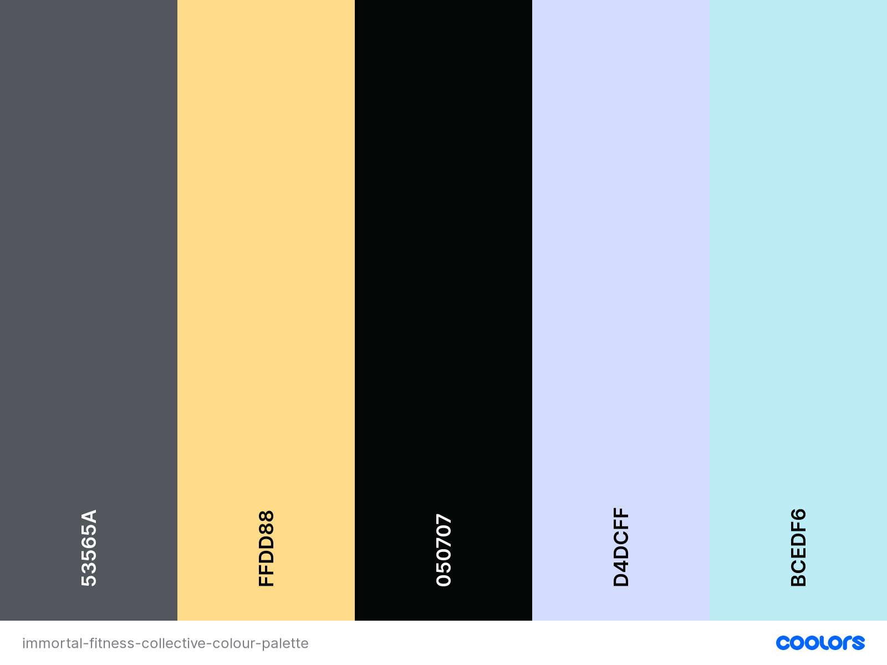

# **Immortal Fitness Collective** - by Russell Oakham

## **Project overview**

Immortal Fitness Collective is an online fitness platform, designed to promote fitness within their community via paid subscription to online fitness plans and selling of fitness apparel, equipment and accessories.

The site is created to engage users who have an interest in improving their personal fitness, with focus on two core fitness programming areas - improved general fitness (everyday fitess) and elite fitness for athletes (competitor fitness).

I have used HTML, CSS, JavaScript and Python (Django and Flask) to build the site, ensuring it is fully responsive for user interaction on their chosen devices.

## **Deployed site**

The live website can be found at teh following link; [PLACEHOLDER]

[PLACEHOLDER IMAGE]

## **Table of Contents**

- [**Deployed site**](#deployed-site)
  - [1. **UX**](#1-ux)
    - [**User Stories**](#user-stories)
    - [**Structure**](#structure)
    - [**Skeleton**](#skeleton)
    - [**Surface**](#surface)
      - [**Colour & Styling**](#colour--styling)
      - [**Language/Tone**](#languagetone)
      - [**Styling Considerations**](#styling-considerations)
  - [2. **Features**](#2-features)
    - [**Existing Features**](#existing-features)
    - [**Features to consider implementing in future**](#features-to-consider-implementing-in-future)
  - [3. **Database Design**](#3-database-design)
    - [**Indexes**](#indexes)
      - [**Recipes**](#recipes)
    - [**Queries**](#queries)
      - [**Browsing**](#browsing)
      - [**Users**](#users)
      - [**Searching**](#searching)
      - [**Uploading**](#uploading)
  - [4. **Technologies Used**](#4-technologies-used)
  - [5. **Testing**](#5-testing)
  - [6. **Deployment**](#6-deployment)
    - [Database Deployment](#database-deployment)
    - [Application Hosting](#application-hosting)
    - [**Heroku**](#heroku)
      - [Creating a Heroku app](#creating-a-heroku-app)
      - [Setting Environmental Variables](#setting-environmental-variables)
      - [Deployment](#deployment)
      - [Automatic Deployment](#automatic-deployment)
    - [GitHub and GitPod repository management](#github-and-gitpod-repository-management)
    - [**How to clone 'Immortal Fitness Collective' in GitHub and GitPod.**](#how-to-clone-immortal-fitness-collective-in-github-and-gitpod)
  - [7. **Credits**](#7-credits)
    - [**Design and research**](#design-and-research)
    - [**Technical**](#technical)
    - [**Content**](#content)
    - [**Media**](#media)
      - [Recipe Category Images:](#recipe-category-images)
      - [404 Error Page](#404-error-page)
    - [**Acknowledgements**](#acknowledgements)

## 1. **UX**

Overview of UX design decisions, including examples of websites I have viewed as part of research and inspiration.

### **User Stories**

<details>
  <summary>Browsing</summary>

  <table>
    <tr>
      <th>Story ID</th>
      <th>User Type</th>
      <th>Goal</th>
      <th>Reason</th>
    </tr>
    <tr>
      <td>US101</td>
      <td>Generic User</td>
      <td>Easily understand purpose and layout of site</td>
      <td>Intuitive navigation, without need for additional instruction</td>
    </tr>
    <tr>
      <td>US102</td>
      <td>Generic User</td>
      <td>Site is responsive across all devices</td>
      <td>Able to view site across all devices easily and without compromise</td>
    </tr>
    <tr>
      <td>US103</td>
      <td>Generic User</td>
      <td>Navigation easily accessible at all times</td>
      <td>Quickly and easily navigate across all site pages</td>
    </tr>
    <tr>
      <td>US104</td>
      <td>Registered User</td>
      <td>Easily access my purchased fitness programme and purchase history</td>
      <td>Quickly and conventiently access product information</td>
    </tr>
  </table>

</details>

<details>
  <summary>Searching</summary>

  <table>
    <tr>
      <th>Story ID</th>
      <th>User Type</th>
      <th>Goal</th>
      <th>Reason</th>
    </tr>
    <tr>
      <td>US201</td>
      <td>Generic User</td>
      <td>Easily view products by category</td>
      <td>Find products of specific type I want</td>
    </tr>
    <tr>
      <td>US203</td>
      <td>Generic User</td>
      <td>View Product Details</td>
      <td>View product details such as description, size and colour</td>
    </tr>
    <tr>
      <td>US204</td>
      <td>Generic User</td>
      <td>Search products by keyword</td>
      <td>Find products easily, for example by name or brand</td>
    </tr>
    <tr>
      <td>US205</td>
      <td>Generic User</td>
      <td>Search and filter products by rating</td>
      <td>Find only the highest-rated products to choose from</td>
    </tr>
    <tr>
      <td>US206</td>
      <td>Generic User</td>
      <td>Search and filter products by brand</td>
      <td>Find only the products from specific brands</td>
    </tr>
  </table>

</details>

<details>
  <summary>Users</summary>

  <table>
    <tr>
      <th>Story ID</th>
      <th>User Type</th>
      <th>Goal</th>
      <th>Reason</th>
    </tr>
    <tr>
      <td>US301</td>
      <td>New User</td>
      <td>Easily register with the site</td>
      <td>Easily purchase products and programming</td>
    </tr>
    <tr>
      <td>US302</td>
      <td>Registered User</td>
      <td>Login and Logout of my account</td>
      <td>Access and update personal details, view subscribed programming and review purchase history, keep my account secure</td>
    </tr>
    <tr>
      <td>US304</td>
      <td>Registered User</td>
      <td>Reset Password</td>
      <td>To improve security of my account and recover access if I forget my password</td>
    </tr>
    <tr>
      <td>US304</td>
      <td>Registered User</td>
      <td>Submit ratings and reviews for purchased products and programming</td>
      <td>Share my experience of the products and programming for other users</td>
    </tr>
    <tr>
      <td>US305</td>
      <td>Registered User</td>
      <td>Unsubscribe from products</td>
      <td>Cease subscription when is appropriate to the user</td>
    </tr>
  </table>

</details>

<details>
  <summary>Administration</summary>

  <table>
    <tr>
      <th>Story ID</th>
      <th>User Type</th>
      <th>Goal</th>
      <th>Reason</th>
    </tr>
    <tr>
      <td>US401</td>
      <td>Admin</td>
      <td>Add, Edit and Delete fitness programming for subscription members</td>
      <td>Easily and time efficeintly manage subscribed content, ensuring high quality product delivery and brand promotion</td>
    </tr>
    <tr>
      <td>US402</td>
      <td>Admin</td>
      <td>Add, Edit and Delete fitness products within site shop</td>
      <td>Manage store content to ensure it is up-to-date and accurate</td>
    </tr>
    <tr>
      <td>US403</td>
      <td>Admin</td>
      <td>Manage access to Subscribed content</td>
      <td>Ensure only users with active subscriptions can access paid-for content</td>
    </tr>
  </table>

</details>

<details>
  <summary>Purchasing and Checkout</summary>

  <table>
    <tr>
      <th>Story ID</th>
      <th>User Type</th>
      <th>Goal</th>
      <th>Reason</th>
    </tr>
    <tr>
      <td>US601</td>
      <td>Generic User</td>
      <td>Easily select type and amount of product to add to basket</td>
      <td>Ensure accuracy of selections</td>
    </tr>
    <tr>
      <td>US602</td>
      <td>Generic User</td>
      <td>View basket contents prior to checkout</td>
      <td>Identify total quantity and cost of items I will recieve</td>
    </tr>
    <tr>
      <td>US603</td>
      <td>Generic User</td>
      <td>Adjust quantity and type of individual products in basket</td>
      <td>Ensure final basket is accurate for desires, prior to checkout</td>
    </tr>
    <tr>
      <td>US604</td>
      <td>Generic User</td>
      <td>Easily enter payment details</td>
      <td>Checkout quickly and efficiently, with minimal hassle</td>
    </tr>
    <tr>
      <td>US605</td>
      <td>Generic User</td>
      <td>Receive assurance personal and payment information is safe and secure</td>
      <td>Confidently provide perosonal and payment information needed to make a purchase</td>
    </tr>
    <tr>
      <td>US606</td>
      <td>Generic User</td>
      <td>View order confirmation after checkout</td>
      <td>Review order details, to ensure there are no user or system mistakes in the order</td>
    </tr>
    <tr>
      <td>US607</td>
      <td>Generic User</td>
      <td>Recieve order confirmation from e-mail after checkout</td>
      <td>Keep order confirmation and purchase details for personal record keeping</td>
    </tr>
  </table>

</details>

<details>
  <summary>General</summary>

  <table>
    <tr>
      <th>Story ID</th>
      <th>User Type</th>
      <th>Goal</th>
      <th>Reason</th>
    </tr>
    <tr>
      <td>US701</td>
      <td>Generic User</td>
      <td>Receive clear feedback for actions on the site</td>
      <td>Know if actions such as product purchase are complete or require further steps</td>
    </tr>
  </table>

</details>
&nbsp;

### **Structure**

Overview of site and page structure, explaining functionality and purpose.

<details>
<summary>Present on all pages</summary>

- _Header/Footer_: For navigation across the site, access their basket and to external resources such as social media pages.
- _Website Logo_: To identify the 'Immortal Fitness Collective' site branding.

</details>

<details>
<summary>Home Page:</summary>

- _Hero Banner_: Promote 'Immortal Fitness Collective' brand awareness and call to action.
- _Testimonials_: Customer testimonials to build brand confidence.
- _Programme Overview_: Banner promoting subscription based fitness programmes on offer.
- _Product Highlight_: Banner highlighting featured products in online shop.
- _Contact Us_: Modal popup to submit contact request form, so users can ask additional questions.

</details>

<details>
<summary>About Us:</summary>

- _About Us Banner_: Promote 'Immortal Fitness Collective' brand awareness and call to action.
- _Our Mission_: Overview of company mission, values and goals.
- _Meet the team_: Staff Profiles, including biographies, qualifications and area of responsibility

</details>

<details>
<summary>Programming:</summary>

- _Programming Banner_: Promote 'Immortal Fitness Collective' Brand awareness.
- _Programme Summaries_: Overview of each fitness programmes package, including suitable fitness goals, time requirement, equipment required and sample workout.
- _Programme CTA_: Call to action link, directing customer to subscription checkout.

</details>

<details>
<summary>Shop / Product Catelogue:</summary>

- _Search Bar_: Text input bar, allowing users to search products by keyword, category and minimum rating.
- _Product Catalogue_: Card format view of products in shop, showing title, image, rating, price and buy now option. Catalogue with update in line with search parameters entered in search bar.
- _Pagination_: Page is paginated after 20 products are displayed, to ensure quick page load and efficient user navigation.

</details>

<details>
<summary>Product Detail:</summary>

- _Product Image_: Provides users a visual of the product.
- _Product Title_: Provides users with the name of the product.
- _Rating_: Allows users to see how highly other users have rated the recipe.
- _Description & Details_: Description of product, including any relevant details.
- _Size Picker_: Allows users to choose product size if applicable.
- _Colour Picker_: Allows users to choose product colour if applicable.
- _Add to Cart_: Button allowing customers to add to cart.
- _Product Price_: Overview of product price showing ex VAT, VAT and Total values.
- _Rate & Review_: Input area, allowing users to submit a rating and review for items they have purchased.
- _Historic Reviews_: List of reviews submitted by users for the product.

</details>

<details>
<summary>Your Basket:</summary>

- _Items in basket_: List of items in basket, showing image, title and price breakdown.
- _Basket Totals_: Overview of basket totals, including quantity and price breakdown.
- _Edit Basket Options_: Options to increase/decrease quantities and remove items from basket.
- _Checkout Now_: Button directing customer to checkout page.

</details>

<details>
<summary>Checkout:</summary>

All inputs will prefill with customer information if user already logged in.

- _Customer Details_: Input for name, email, contact number.
- _Delivery Address_: Input for delivery address.
- _Payment Information_: Input for payment information, card details, billing address - using Stripe payments integration.
- _Basket Summary_: Itemised summary of basket being paid for, including total cost breakdowns. Include payment plan information if purchasing programming subscription.

</details>

<details>
<summary>Purchase Confirmation / Error:</summary>

- _Purchase Confirmation / Error Message_: Message confirming successful or unsuccessful completion of purchase.
- _Purchase Summary_: Summary of purchase information, including delivery address.

</details>

<details>
<summary>User Login / Registration:</summary>

- _Username Input_: Text input box, allowing users to enter their username.
- _Password Input_: Text input box, allowing users to enter their password.
- _Password Confirmation (Registration)_ : Text input box, must match password input, to ensure user does not incorrectly type password while registering.
- _Forgot Password_: Link allowing users to request forgotten password e-mail.
- _Submit / Cancel_: Buttons allowing users to submit entered information, or cancel and restart.

</details>

<details>
<summary>User Profile:</summary>

- _Username Banner_: Banner displaying the username of logged in account, allowing users to quickly identify if they are logged into their correct desired account.
- _Purchase History_: All historical purchases by the user displayed in list format.
- _Active Subscriptions_: List of all active subscriptions, with links to private programming pages.

</details>

<details>
<summary>Members Programming:</summary>

- _Daily Workout_: Daily view of workouts programmed for the week, with details on exercise standards and time domains.
- _Pagination_: Each page shows one week of programming.

</details>

<details>
<summary>Add Programming:</summary>

- _Input areas for below workout data points_:
- Workout Title - Text
- Date - Date Picket
- Workout - Text

</details>

<details>
<summary>Edit Programming:</summary>

Inputs are pre-populated with historic workout information.

- _Input areas for below workout data points_:
- Workout Title - Text
- Date - Date Picket
- Workout - Text

</details>

&nbsp;

### **Skeleton**

At this point I began creating wireframes, using the above structure considerations. I used [Balsamiq](https://balsamiq.com/) these below;

- [Wireframes PDF](markdown-resources/wireframes/Immortal-Fitness-Collective.pdf)

### **Surface**

This is the sensory design section of a website, or how it looks, feels and sounds.

#### **Colour & Styling**

Upon deciding the brand the website as 'Immortal Fitness Collective' I found [this](markdown-resources/img/immortal-fc-logo.png) in Canva.

I decided to style the logo with the following three colours, to envoke the related emotions;

- Gold: To represent a goal to be striven for.
- Gun metal grey: To represent industry and hard work required to achieve the goal.
- White: To denote transparency and honesty found in hard work.

These colours also serve to provide a light and clean aesthetic, which fits desired design of the wider site very well. Once these colours were picked, I used Canva's colour palette generator to find complementary colours to use across the site.

<details>
<summary>Colour Palette</summary>



</details>

I also used a selection of off-white and off-black colours to provide additional accenting to general white/black website elements, such as backgrounds and fonts.

#### **Language/Tone**

I wanted the language to reflect a semiserious but fun atmosphere, reflecting a the brands goal to deliver fitness programming via challenging, but fun fitness programming. Therefore content was written in this style, avoiding overly technical or formal language where possible.

Similarly, I wanted to use fonts that reinforce the identity of the site, while remaining easy to read. To achieve this I used the following two Google Fonts;

- IBM Plex Sans - A typeface designed for IBM to capture the relationship between humankind and machine. This relates well to IFCs brand, who wish to capture the relationship being mind (spirit) and body (machine).
- Poppins - A geometric sans serif, designed for to be monolinear and highly legible.
- Sans-serif - Web safe font, used if primary two fonts fail to load.

#### **Styling Considerations**

Before beginning development, I listed some styling ideas that I felt benefit the website. The majority of these can be seen in the wireframes.

- Favicon: Desktop and Mobile.
- Navigation
  - Sticky top
  - Mobile: 'Burger' menu icon, expanding on click.
  - Logo: Navigates to the home page on click.

## 2. **Features**

### **Existing Features**

&nbsp;

### **Features to consider implementing in future**

&nbsp;

## 3. **Database Design**

PostgreSQL was the database solution used for the website development, using the below, structured plan.

&nbsp;

## 4. **Technologies Used**

<details>
<summary>
Languages
</summary>
<ul>
<li><a href="https://en.wikipedia.org/wiki/HTML">HTML</a> - Programming language providing content and structure of the website.</li>
<li><a href="https://en.wikipedia.org/wiki/CSS">CSS</a> - Programming language providing styling of the website.</li>
<li><a href="https://en.wikipedia.org/wiki/JavaScript">JavaScript</a> - Programming language used for various interactive elements of the website, including game logic, audio options etc.</li>
<li><a href="https://en.wikipedia.org/wiki/Python_(programming_language)">Python</a> - Programming language used to drive core site functionality including user login and push/retrieving database information.</li>
<li><a href="https://en.wikipedia.org/wiki/Jinja_(template_engine)">Jinja</a> - Used to generate HTML from site templates</li>
</ul>
</details>

<details>
<summary>Libraries</summary>
<ul>
<li><a href="https://getbootstrap.com/">Bootstrap CSS Framework</a> - Library of pre-built HTML and CSS components, used for various aspects of the site, such as navigation bar.</li>
<li><a href="https://fontawesome.com/">Font Awesome</a> - Library used for icons, such as social links and other images.</li>
<li><a href="https://fonts.google.com/">Google Fonts</a> - Font style library.</li>
<li><a href="https://jqueryui.com/">jQuery</a> - JavaScript library used for simplification of JS scripts and DOM manipulation.</li>
<li><a href="https://flask.palletsprojects.com/en/1.1.x/">Flask</a> - Micro-framework to simplify Python scripting and web server tasks.</li>
<li><a href="https://werkzeug.palletsprojects.com/en/1.0.x/">Werkzeug</a> - Python library to manage user management integrity.</li>
</ul>
</details>

<details>
<summary>Editors</summary>
<ul>
<li><a href="https://github.com/">GitHub</a> - Remote code repository.</li>
<li><a href="https://gitpod.io/">GitPod</a> - IDE (Integrated Development Environment), for writing, editing and saving code.</li>
<li><a href="https://dbdiagram.io/">dbDiagram</a> - Used to plan and visualise database structure</li>
<li><a href="https://balsamiq.com/">Balsamiq</a> - Wireframes for visual design testing.</li>
</ul>
</details>

<details>
<summary>Tools</summary>
<ul>
<li><a href="https://cloudinary.com/">Cloudinary</a> - Plugin used for upload and hosting of user images</li>
<li><a href="https://tinypng.com/">TinyPNG</a> & <a href="https://tinyjpg.com/">TinyJPG</a> -  Minimise image file sizes and maximise page load speed.</li>
<li><a href="https://www.remove.bg/">remove.bg</a> - Remove backgrounds from png images.</li>
<li><a href="https://www.canva.com/">Canva</a> - Color Palette Generation and Logo</li>
<li><a href="https://imagecolorpicker.com/">Image Color Picker</a> - Determine Hex code color in exisiting graphics</li>
<li><a href="https://realfavicongenerator.net/">Real Favicon Generator</a> - Generate favicons and icons for desktop and mobile usage.</li>
<li><a href="https://autoprefixer.github.io/">Autoprefixer</a> - Vendor prefixes to CSS rules.</li>
<li><a href="http://ami.responsivedesign.is/">Am I Responsive?</a> - Responsive design demo in ReadMe summary.</li>
<li><a href="https://www.responsivedesignchecker.com/">Responsive Design Checker</a> - Check website response across device types.</li>
<li><a href="https://www.lambdatest.com/">Lambdatest</a> - Check website response across device types.</li>
</ul>
</details>

<details>
<summary>Database Management</summary>
<ul>
<li><a href="https://www.mongodb.com/">MongoDB</a> - Cloud based database management system, used for storing user profile and recipe information.</li>
</ul>
</details>

<details>
<summary>Deployment Platform</summary>
<ul>
<li><a href="https://www.heroku.com/">Heroku</a> - Remote hosting platform, for hosting of python driven websites and applications.</li>
</ul>
</details>

&nbsp;

## 5. **Testing**

The testing process can be seen in the [TESTING.md](testing.md) document.

&nbsp;

## 6. **Deployment**

### Database Deployment

### Application Hosting

### **Heroku**

The site is hosted using [Heroku](https://www.heroku.com/), deployed directly from the master branch of GitHub. The deployed site will update automatically as new commits are pushed to the master branch.

#### Creating a Heroku app

- From the Heroku dashboard:

  - Select "New"
  - Select "Create new app"

    

- Add new app details to form:

  - Add app name (must be unique)
  - Select region
  - Click "Create App"

    

#### Setting Environmental Variables

- From the Heroku dashboard:

  - Select your app from the list

    

- Select "Settings" from the top menu:

  - Under 'Config Vars', select "Reveal Config Vars"
  - Add environment variables in key-value pairs, click "Add" to add additional pairings.

    

#### Deployment

- Create required deployment files in the repository:

  - requirements.txt

    - Lists the required python modules for Heroku to install.
    - To create:
      - In your IDE terminal, type: pip freeze > requirements.txt

  - Procfile

    - Tells Heroku the command to launch the app.
    - To create:
      - in your IDE terminal, type: python app.py > Procfile

  - .gitignore (optional)
    - Lists files and directories which should be deployed to live app, such as files with environmental passkeys.
    - To create:
      - In your IDE terminal, type: touch .gitignore
      - List the files and directories to be excluded from live deployment, within the .gitignore file.
      - Save in your repository root directory.

- From the application top menu:

  - Select 'Deploy'
  - Choose your Deployment method:

    - Github:

      - Select the correct Github account.
      - Type in the repository name you wish to deploy.
      - Choose the correct repository from search results.
      - Select "Connect"

      

    - Manual Deployment:

      - Choose the correct branch you wish to deploy from the drop-down.
      - Select "Deploy Branch"
      - Heroku will return "Your App has successfully deployed". If this shows an error, troubleshooting will be needed.

      

#### Automatic Deployment

- From the application top menu:
  - Select 'Deploy'
  - Ensure app is connected to correct repository
  - Under 'Automatic Deployment' section:
    - Select 'Enable Automatic Deployment"

### GitHub and GitPod repository management

### **How to clone 'Immortal Fitness Collective' in GitHub, GitPod and setup on Heroku.**

To run a version of the site locally, you can clone this repository using the following steps;

In a code editor of your choice;

1. Go to [GitHub.com](https://github.com/)
2. Click on 'Responsitories'
3. Click on 'Immortal Fitness Collective'
4. Click on the 'Code' button.
5. Under 'HTTPS' click the clipboard icon to the right of the URL.
6. In your IDE of choice, open a repository or create a new repository.
7. Open Terminal \('Terminal' then 'New Terminal' from the top ribbon menu in GitPod.\)
8. Type 'git clone', paste URL link and press enter.

Additional information around these cloning steps can be found on [GitHub Pages Help Page](https://docs.github.com/en/github/creating-cloning-and-archiving-repositories/cloning-a-repository).
&nbsp;

#### Installing Requirements

- Install all requirements modules to your local IDE with the following CL:

```
 pip3 install -r requirements.txt
```

#### Create Collections in MongoDB

- Login to your MongoDB account
- Create a Cluster

- Create a database using the following architecture;

<details>
Placeholder
</details>

#### Setup Environmental Variables

### Setup Unique Identifies / Environment Variables

#### SECRET_KEY

#### MONGO_URI

#### MONGO_DBNAME

This is the name of your database in MongoDB. Which can be foung under the 'Collections' tab, under your cluster.

#### Running Development Server

To launch a Http server using the development mode code for the application, use the following command in your IDE:

```

Placeholder

```

## 7. **Credits**

### **Design and research**

The following are websites and articles that I used for reference and inspiration:

### **Technical**

- [Real Favicon Generator](https://realfavicongenerator.net/) - For the generation of Favicon icons and code.
- [Materialize Docs](https://materializecss.com/getting-started.html) - For guidance on Materialize use and adaptations.
- [CSS-Tricks](https://css-tricks.com/) - For implementing CSS effects such as box-shadow.
- [w3Schools](https://www.w3schools.com/) - For checking proper syntax of HTML and CSS elements.
- [Autoprefixer](https://autoprefixer.github.io/) - For generating CSS browser prefixes.
- [Stackoverflow](https://stackoverflow.com/) - For researching and troubleshooting JavaScript and Python code issues.
- [Miguel Grinberg](https://blog.miguelgrinberg.com/index) - For researching and troubleshooting Python functionality and code issues.
- [MongoDB Documentation](https://docs.mongodb.com/) - For researching and troubleshooting database code commands and issues.

### **Content**

All text content on the site was written originally by myself, with the below notes;

### **Media**

The photos and images used for this site were obtained.

- [**Shutterstock**](https://www.shutterstock.com/): From the following contributors;

#### 404 Error Page

### **Acknowledgements**

- Thanks to my mentor, [Precious Ijege](https://github.com/precious-ijege) for their suggestions, time and support.
- Thanks to those on Slack for reviewing my project and making suggestions.
- Thanks to my housemates, friends and family for reviewing the project and offering constructive feedback.
