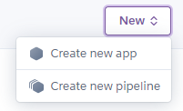

# **Immortal Fitness Collective** - by Russell Oakham

## **Project overview**

Immortal Fitness Collective is an online fitness platform, designed to promote fitness within their community via free online fitness plans and selling of fitness apparel, equipment and accessories.

The site is created to engage users who have an interest in improving their personal fitness, with focus on two core fitness programming areas - improved general fitness (everyday fitness) and elite fitness for athletes (competitor fitness).

I have used HTML, CSS, JavaScript and Python (Django and Flask) to build the site, ensuring it is fully responsive for user interaction on their chosen devices.

## **Deployed site**

The live website can be found at teh following link; [Immortal Fitness Collective](https://immortal-fitness-collective.herokuapp.com/)


**To open any links in this document in a new tab press `CTRL + Click`.**

The following details should be used when trying to submit an order on the checkout page:

- Card Number: 4242 4242 4242 4242
- Expiration Date: Any future date (e.g. 02/24)
- CVC: Any three digits

## **Table of Contents**

- [**Deployed site**](#deployed-site)
  - [1. **UX**](#1-ux)
    - [**User Stories**](#user-stories)
    - [**Structure**](#structure)
    - [**Skeleton**](#skeleton)
    - [**Surface**](#surface)
      - [**Colour & Styling**](#colour--styling)
      - [**Language/Tone**](#languagetone)
      - [**Styling Considerations**](#styling-considerations)
  - [2. **Features**](#2-features)
    - [**Existing Features**](#existing-features)
    - [**Features to consider implementing in future**](#features-to-consider-implementing-in-future)
  - [3. **Database Design**](#3-database-design)
    - [**Indexes**](#indexes)
      - [**Recipes**](#recipes)
    - [**Queries**](#queries)
      - [**Browsing**](#browsing)
      - [**Users**](#users)
      - [**Searching**](#searching)
      - [**Uploading**](#uploading)
  - [4. **Technologies Used**](#4-technologies-used)
  - [5. **Testing**](#5-testing)
  - [6. **Deployment**](#6-deployment)
    - [Database Deployment](#database-deployment)
    - [Application Hosting](#application-hosting)
    - [**Heroku**](#heroku)
      - [Creating a Heroku app](#creating-a-heroku-app)
      - [Setting Environmental Variables](#setting-environmental-variables)
      - [Deployment](#deployment)
      - [Automatic Deployment](#automatic-deployment)
    - [GitHub and GitPod repository management](#github-and-gitpod-repository-management)
    - [**How to clone 'Immortal Fitness Collective' in GitHub and GitPod.**](#how-to-clone-immortal-fitness-collective-in-github-and-gitpod)
  - [7. **Credits**](#7-credits)
    - [**Design and research**](#design-and-research)
    - [**Technical**](#technical)
    - [**Content**](#content)
    - [**Media**](#media)
      - [Recipe Category Images:](#recipe-category-images)
      - [404 Error Page](#404-error-page)
    - [**Acknowledgements**](#acknowledgements)

## 1. **UX**

Overview of UX design decisions, including examples of websites I have viewed as part of research and inspiration.

### **User Stories**

<details>
  <summary>Browsing</summary>

  <table>
    <tr>
      <th>Story ID</th>
      <th>User Type</th>
      <th>Goal</th>
      <th>Reason</th>
    </tr>
    <tr>
      <td>US101</td>
      <td>Generic User</td>
      <td>Clearly understand purpose and layout of site</td>
      <td>Intuitive navigation, without need for additional instruction</td>
    </tr>
    <tr>
      <td>US102</td>
      <td>Generic User</td>
      <td>Site is responsive across all devices</td>
      <td>Able to view site across all devices clearly and without compromise</td>
    </tr>
    <tr>
      <td>US103</td>
      <td>Generic User</td>
      <td>Navigation clearly accessible at all times</td>
      <td>Quickly and clearly navigate across all site pages</td>
    </tr>
    <tr>
      <td>US104</td>
      <td>Registered User</td>
      <td>Clearly access my purchase history</td>
      <td>Quickly and conveniently access product information</td>
    </tr>
  </table>

</details>

<details>
  <summary>Searching</summary>

  <table>
    <tr>
      <th>Story ID</th>
      <th>User Type</th>
      <th>Goal</th>
      <th>Reason</th>
    </tr>
    <tr>
      <td>US201</td>
      <td>Generic User</td>
      <td>Easily view products by category</td>
      <td>Find products of specific type I want</td>
    </tr>
    <tr>
      <td>US202</td>
      <td>Generic User</td>
      <td>View Product Details</td>
      <td>View product details such as description, size and colour</td>
    </tr>
    <tr>
      <td>US203</td>
      <td>Generic User</td>
      <td>Search products by keyword</td>
      <td>Find products with ease, for example by name or brand</td>
    </tr>
    <tr>
      <td>US204</td>
      <td>Generic User</td>
      <td>Sort products by rating</td>
      <td>Find only the highest-rated products to choose from</td>
    </tr>
    <tr>
      <td>US205</td>
      <td>Generic User</td>
      <td>Sort products by price</td>
      <td>Find products that fit their personal budget</td>
    </tr>
  </table>

</details>

<details>
  <summary>Users</summary>

  <table>
    <tr>
      <th>Story ID</th>
      <th>User Type</th>
      <th>Goal</th>
      <th>Reason</th>
    </tr>
    <tr>
      <td>US301</td>
      <td>New User</td>
      <td>Easily register with the site</td>
      <td>Easily purchase products and programming</td>
    </tr>
    <tr>
      <td>US302</td>
      <td>Registered User</td>
      <td>Login and Logout of my account</td>
      <td>Access and update personal details, view subscribed programming and review purchase history, keep my account secure</td>
    </tr>
    <tr>
      <td>US303</td>
      <td>Registered User</td>
      <td>Reset Password</td>
      <td>To improve security of my account and recover access if I forget my password</td>
    </tr>
    <tr>
      <td>US304</td>
      <td>Registered User</td>
      <td>Submit ratings and reviews for purchased products and programming</td>
      <td>Share my experience of the products and programming for other users</td>
    </tr>
  </table>

</details>

<details>
  <summary>Administration</summary>

  <table>
    <tr>
      <th>Story ID</th>
      <th>User Type</th>
      <th>Goal</th>
      <th>Reason</th>
    </tr>
    <tr>
      <td>US401</td>
      <td>Admin</td>
      <td>Add, Edit and Delete fitness programming for subscription members</td>
      <td>Easily and time efficiently manage subscribed content, ensuring high quality product delivery and brand promotion</td>
    </tr>
    <tr>
      <td>US402</td>
      <td>Admin</td>
      <td>Add, Edit and Delete fitness products within site shop</td>
      <td>Manage store content to ensure it is up-to-date and accurate</td>
    </tr>
    <tr>
      <td>US403</td>
      <td>Admin</td>
      <td>Delete user reviews if they violate site terms</td>
      <td>Ensure any offensive reviews can be removed for brand and user protection</td>
    </tr>
  </table>

</details>

<details>
  <summary>Purchasing and Checkout</summary>

  <table>
    <tr>
      <th>Story ID</th>
      <th>User Type</th>
      <th>Goal</th>
      <th>Reason</th>
    </tr>
    <tr>
      <td>US501</td>
      <td>Generic User</td>
      <td>Easily select type and amount of product to add to basket</td>
      <td>Ensure accuracy of selections</td>
    </tr>
    <tr>
      <td>US502</td>
      <td>Generic User</td>
      <td>View basket contents prior to checkout</td>
      <td>Identify total quantity and cost of items I will receive</td>
    </tr>
    <tr>
      <td>US503</td>
      <td>Generic User</td>
      <td>Adjust quantity and type of individual products in basket</td>
      <td>Ensure final basket is accurate for desires, prior to checkout</td>
    </tr>
    <tr>
      <td>US504</td>
      <td>Generic User</td>
      <td>Easily enter payment details</td>
      <td>Checkout quickly and efficiently, with minimal hassle</td>
    </tr>
    <tr>
      <td>US505</td>
      <td>Generic User</td>
      <td>Receive assurance personal and payment information is safe and secure</td>
      <td>Confidently provide perosonal and payment information needed to make a purchase</td>
    </tr>
    <tr>
      <td>US506</td>
      <td>Generic User</td>
      <td>View order confirmation after checkout</td>
      <td>Review order details, to ensure there are no user or system mistakes in the order</td>
    </tr>
    <tr>
      <td>US507</td>
      <td>Generic User</td>
      <td>Recieve order confirmation from e-mail after checkout</td>
      <td>Keep order confirmation and purchase details for personal record keeping</td>
    </tr>
  </table>

</details>

<details>
  <summary>General</summary>

  <table>
    <tr>
      <th>Story ID</th>
      <th>User Type</th>
      <th>Goal</th>
      <th>Reason</th>
    </tr>
    <tr>
      <td>US601</td>
      <td>Generic User</td>
      <td>Receive clear feedback for actions on the site</td>
      <td>Know if actions such as product purchase are complete or require further steps</td>
    </tr>
  </table>

</details>
&nbsp;

### **Structure**

Overview of site and page structure, explaining functionality and purpose.

<details>
<summary>Present on all pages</summary>

- _Header/Footer_: For navigation across the site, access to basket and to external resources such as social media pages.
- _Website Logo_: To identify the 'Immortal Fitness Collective' site branding.

</details>

<details>
<summary>Home Page:</summary>

- _Hero Banner_: Promote 'Immortal Fitness Collective' brand awareness and call to action.
- _Testimonials_: Customer testimonials to build brand confidence. -- TO DO --
- _Programme Overview_: Banner promoting free fitness programmes on offer.
- _Contact Us_: Modal popup to submit contact request form, so users can ask additional questions.

</details>

<details>
<summary>About Us:</summary>

- _About Us Banner_: Promote 'Immortal Fitness Collective' brand awareness and call to action.
- _Our Mission_: Overview of company mission, values and goals.
- _Meet the team_: Staff Profiles, including biographies, qualifications and area of responsibility

</details>

<details>
<summary>Programming:</summary>

- _Daily Workout_: Daily view of workouts programmed for the week, with details on exercise standards and time domains.
- _Pagination_: Page is paginated after 5 workout posts are displayed, to ensure quick page load and efficient user navigation.

</details>

<details>
<summary>Workout Detail:</summary>

- _Workout Post_: Detail of each daily workout programmed for the week.

</details>

<details>
<summary>Shop / Product Catalogue:</summary>

- _Search Bar_: Text input bar, allowing users to search products by keyword, category and minimum rating.
- _Product Catalogue_: Card format view of products in shop, showing title, image, rating, price and buy now option. Catalogue with update in line with search parameters entered in search bar.

</details>

<details>
<summary>Product Detail:</summary>

- _Product Image_: Provides users a visual of the product.
- _Product Title_: Provides users with the name of the product.
- _Rating_: Allows users to see how highly other users have rated the recipe.
- _Description & Details_: Description of product, including any relevant details.
- _Size Picker_: Allows users to choose product size if applicable.
- _Add to Cart_: Button allowing customers to add to cart.
- _Product Price_: Overview of product price showing ex VAT, VAT and Total values.
- _Rate & Review_: Input area, allowing users to submit a rating and review for items they have purchased.
- _Historic Reviews_: List of reviews submitted by users for the product.

</details>

<details>
<summary>Your Basket:</summary>

- _Items in basket_: List of items in basket, showing image, title and price breakdown.
- _Basket Totals_: Overview of basket totals, including quantity and price breakdown.
- _Edit Basket Options_: Options to increase/decrease quantities and remove items from basket.
- _Checkout Now_: Button directing customer to checkout page.

</details>

<details>
<summary>Checkout:</summary>

All inputs will pre-fill with customer information if user already logged in.

- _Customer Details_: Input for name, email, contact number.
- _Delivery Address_: Input for delivery address.
- _Payment Information_: Input for payment information, card details, billing address - using Stripe payments integration.
- _Basket Summary_: Itemised summary of basket being paid for, including total cost breakdowns. Include payment plan information if purchasing programming subscription.

</details>

<details>
<summary>Purchase Confirmation / Error:</summary>

- _Purchase Confirmation / Error Message_: Message confirming successful or unsuccessful completion of purchase.
- _Purchase Summary_: Summary of purchase information, including delivery address.

</details>

<details>
<summary>User Login / Registration:</summary>

- _Username Input_: Text input box, allowing users to enter their username.
- _Password Input_: Text input box, allowing users to enter their password.
- _Password Confirmation (Registration)_ : Text input box, must match password input, to ensure user does not incorrectly type password while registering.
- _Forgot Password_: Link allowing users to request forgotten password e-mail.
- _Submit / Cancel_: Buttons allowing users to submit entered information, or cancel and restart.

</details>

<details>
<summary>User Profile:</summary>

- _Username Banner_: Banner displaying the username of logged in account, allowing users to quickly identify if they are logged into their correct desired account.
- _Purchase History_: All historical purchases by the user displayed in list format.
- _Active Subscriptions_: List of all active subscriptions, with links to private programming pages.

</details>

<details>
<summary>Add Workout:</summary>

- _Input areas for below workout data points_:
- Date - Date Picker
- Strength Workout Title - Text
- Strength Workout - Text
- Metcon Workout Title - Text
- Metcon Workout - Text
- Skills Workout Title - Text
- Skills Workout - Text

</details>

<details>
<summary>Edit Workout:</summary>

Inputs are pre-populated with historic workout information.

- _Input areas for below workout data points_:
- Date - Date Picker
- Strength Workout Title - Text
- Strength Workout - Text
- Metcon Workout Title - Text
- Metcon Workout - Text
- Skills Workout Title - Text
- Skills Workout - Text

</details>

&nbsp;

### **Skeleton**

At this point I began creating wire-frames, using the above structure considerations. I used [Balsamiq](https://balsamiq.com/) these below;

- [Wireframes PDF](markdown-resources/wireframes/Immortal-Fitness-Collective.pdf)

### **Surface**

This is the sensory design section of a website, or how it looks, feels and sounds.

#### **Colour & Styling**

Upon deciding the brand the website as 'Immortal Fitness Collective' I found [this](markdown-resources/img/immortal-fc-logo.png) in Canva.

I decided to style the logo with the following three colours, to envoke the related emotions;

- Gold: To represent a goal to be striven for.
- Gun metal grey: To represent industry and hard work required to achieve the goal.
- White: To denote transparency and honesty found in hard work.

These colours also serve to provide a light and clean aesthetic, which fits desired design of the wider site very well. Once these colours were picked, I used Canva's colour palette generator to find complementary colours to use across the site.

<details>
<summary>Colour Palette</summary>


</details>

I also used a selection of off-white and off-black colours to provide additional accenting to general white/black website elements, such as backgrounds and fonts.

#### **Language/Tone**

I wanted the language to reflect a semiserious but fun atmosphere, reflecting a the brands goal to deliver fitness programming via challenging, but fun fitness programming. Therefore content was written in this style, avoiding overly technical or formal language where possible.

Similarly, I wanted to use fonts that reinforce the identity of the site, while remaining easy to read. To achieve this I used the following two Google Fonts;

- Roboto Mono - A monospaced addition to the Roboto type family, optimised for readability on screen of of all sizes and device types.
- Poppins - A geometric sans serif, designed for to be monolinear and highly legible.
- Sans-serif - Web safe font, used if primary two fonts fail to load.

#### **Styling Considerations**

Before beginning development, I listed some styling ideas that I felt benefit the website. The majority of these can be seen in the wireframes.

- Favicon: Desktop and Mobile.
- Navigation
  - Sticky top
  - Mobile: 'Burger' menu icon, expanding on click.
  - Logo: Navigates to the home page on click.

## 2. **Features**

The site allows normal users to browse daily workouts and follow the free fitness programming offered by the organisation. Normal users can both browse products by categories and search for specific products by search term. Normal users create user accounts, save their personal and delivery information and purchase products via stripes secure checkout functionality. E-mail confirmation is provided for key activities such as account creation.

### **Existing Features**

<details>
<summary>The Header:</summary>

* **Website Logo**: Builds brand awareness amongst users.
* **Navigation Bar**: Allows users to navigate the site easily and intuitively, as well as login/register their account and search for products
</details>

<details>
<summary>The Footer:</summary>

* **Website Logo**: Builds brand awareness amongst users.
* **Navigation**: Allows users a second option for navigating to key site pages.
* **Business Contact Links**: Links to company contact details, including telephone, address and business registration.

Both the Header and Footer are present and consistent on all website pages.
</details>

<details>
<summary>Home page:</summary>

* **Image Banner**: Visually pleasing design, allowing users to immediately identify the site brand, includes CTA button to navigate customers to online shop.
* **Company Summary**: Short summary of company purpose, with cta encouraging customers to learn more.
* **Programme Summary**: Visually pleasing summary of the free fitness programmes currently offered, with CTA section encouraging customers to navigate to programming pages.

</details>

<details>
<summary>About Us page:</summary>

* **Company Mission Statement**: Summary explaining company mission statement, values and identity.
* **Meet the team**: Profiles of all key staff members, providing photos and short biography.

</details>

<details>
<summary>Programming pages:</summary>

* **Latest Workouts**: Details of latest programmed workouts..
* **URL Filtering**: The navigation menu has links to both the fitness programmes on offer, clicking on each will automatically display workouts filtered by the programme you have selected.
* **Back to top button**: Button situated in bottom right of screen, allowing users to instantly relocate their view to the top of the page.

</details>

<details>
<summary>Product pages:</summary>

* **Product Cards**: List of products for chosen category/search criteria, showing key information such as visual image, name, rating and price.
* **Sort By**: Sort functionality, allowing users to order by price, rating name or category.
* **Category Badges**: When a category filter is in use, badges for all categories selected will appear under the H1. Clicking these badges will refine the category filter further.
* **Products Home Link**: To the top-left of the products page is a 'Products Home' link, which allows users to easily revert their view back to non-filtered 'all' products view.
* **Back to top button**: Button situated in bottom right of screen, allowing users to instantly relocate their view to the top of the page.

</details>

<details>
<summary>Product Detail page:</summary>

Detailed information on selected product and shopping options:

* **Product Image**: Detailed picture of image.
* **Product Name**: Full Product Name
* **Product Price**: Product Sales Price
* **Category**: Product Category
* **Rating**: Avg. rating of all product reviews.
* **Product Description**: Detailed description of product
* **Size Selector**: Drop down size selector if product has sizing options.
* **Quantity Selector**: Drop down quantity selector, allowing users to add multiple items to basket.
* **Keep Shopping/Add to Bag Buttons**: Buttons allowing users to add item to bag and also to navigate back to 'all' products page to continue shopping.
* **Leave a Review**: Logged in users are able to view and submit a form, allowing them to review and rate products.
* **Reviews**: List display of all reviews for the product, left by users.
* **Edit/Delete Product Button**: Product Edit and Delete buttons are also rendered for superadmins, allowing quick access to product admin pages.

</details>

<details>
<summary>Product Management Page:</summary>

* **Input areas for below product data points**:
    * _Category_ - Drop down menu
    * _SKU_ - Text
    * _Name_ - Text
    * _Description_ - Text
    * _Has Sizes_ - Drop down menu
    * _Has Shoe Sizes_ - Drop down menu
    * _Rating_ - Numeric
    * _Price_ - Numeric
    * _image url_ - Text
    * _select image_ - file upload

</details>

<details>
<summary>Edit Product Page:</summary>

* **Input areas for below product data points**:
    * _Category_ - Drop down menu
    * _SKU_ - Text
    * _Name_ - Text
    * _Description_ - Text
    * _Has Sizes_ - Drop down menu
    * _Has Shoe Sizes_ - Drop down menu
    * _Rating_ - Numeric
    * _Price_ - Numeric
    * _image url_ - Text
    * _select image_ - file upload

Data is pre-filled with exisiting product information on page load.

</details>

<details>
<summary>Workout Management Page:</summary>

* **Input areas for below workout data points**:
    * _Category_ - Drop down menu
    * _Title_ - Text
    * _Workout Date_ - Date picker
    * _Weightlifting Title_ - Text
    * _Weightlifting Description_ - Text
    * _Weightlifting Title_ - Text
    * _Weightlifting Description_ - Text
    * _Weightlifting Title_ - Text
    * _Weightlifting Description_ - Text

</details>

<details>
<summary>Edit Workout Page:</summary>

* **Input areas for below workout data points**:
    * _Category_ - Drop down menu
    * _Title_ - Text
    * _Workout Date_ - Date picker
    * _Weightlifting Title_ - Text
    * _Weightlifting Description_ - Text
    * _Weightlifting Title_ - Text
    * _Weightlifting Description_ - Text
    * _Weightlifting Title_ - Text
    * _Weightlifting Description_ - Text

Data is pre-filled with exisiting workout information on page load.

</details>

<details>
<summary>Login / Registration page:</summary>

* **Username Input**: Input area for users to enter their profile username.
* **Password**: Input area for users to enter their profile password.
* **Confirm Password** (Registration page): Input area for users to confirm password, must match password input for successful registration.
* **Cancel**: Cancellation button, clearing input text allowing users to refill entries.
* **Login/Registration Button**: Button allowing users to login to their account or register for a new account.
* **Remember Me Checkbox**: Checkbox, enabling users to allow site to remember login credentials.
* **Forgot Password?**: Option allowing users to receive a new password to their registered e-mail in the event they forger their current password.

</details>

<details>
<summary>User Profile page:</summary>

* **Default Delivery Information**: Form prefilled with users current delivery information, users can updated their information here.
* **Order History**: Summary view of historic orders showing key order information and allowing users to view copy of order confirmation pages.

</details>

<details>
<summary>Bag page:</summary>

* **Items in bag summary**: Summary view of all items added to bag, allowing users to update item quantities and remove items.
* **Bag Value Summary**: Summary showing monetary value of bag, including delivery charge.
* **Keep Shopping/Secure Checkout Buttons**: Buttons allowing users to proceed to secure checkout and also to navigate back to 'all' products page to continue shopping.

</details>

<details>
<summary>Secure Checkout page:</summary>

* **Customer Details**: Form inputs for customer to input name and e-mail address.
* **Delivery Details**: Form inputs for customer to input delivery information.
* **Save Delivery Info Checkbox**: Checkbox allowing customers to save delivery information to their profile.
* **Payment Details**: Form input for customers to input card payment information, using stripe secure payment integration.
* **Order Summary**: Summary view of all items in order, allowing customers to easily check accuracy.
* **Adjust Bag/Complete Order Buttons**: Buttons allowing users to proceed with payment or to navigate back to 'bag' page to adjust their order.

</details>

<details>
<summary>Order Confirmation page:</summary>

* **Order Summary**: Summary view of all items in order, allowing customers to easily check accuracy.
* **Back to Profile Buttons**: Buttons allowing users to navigate back to 'profile' page.

</details>

&nbsp;

### **Features to consider implementing in future**

#### Subscriptions

The site notes Immortal Fitness Collective is planning to expand its offering with a nutrition programme to be launched in future. This could be monetized via integration of [Stripe Billing](https://stripe.com/gb/billing), to allow customer subscriptions.

#### Expanded Search

The product search functionality can be expanded to include additional search criteria such as search by product rating.

#### Social Media Integration

Enable login via social media account, such as Google, Facebook or Instagram, to allow users easy account creation and access. Integrate quick-links for users to post products to their social media and chat applications, to help promote and share products with their friends and followers.

#### Enhanced Payment Options

Integrate Google and Apply Pay to the checkout experience, allowing users expanded payment options and reducing customer journey friction for payment on mobile devices.

&nbsp;

## 3. **Database Design**

Relational databases were used for this project. SQLite was used during development, while Heroku PostgreSQL is used in production. The database can be seen in the below diagram.


&nbsp;

## 4. **Technologies Used**

<details>
<summary>
Languages
</summary>
<ul>
<li><a href="https://en.wikipedia.org/wiki/HTML">HTML</a> - Programming language providing content and structure of the website.</li>
<li><a href="https://en.wikipedia.org/wiki/CSS">CSS</a> - Programming language providing styling of the website.</li>
<li><a href="https://en.wikipedia.org/wiki/JavaScript">JavaScript</a> - Programming language used for various interactive elements of the website, including game logic, audio options etc.</li>
<li><a href="https://en.wikipedia.org/wiki/Python_(programming_language)">Python</a> - Programming language used to drive core site functionality including user login and push/retrieving database information.</li>
<li><a href="https://en.wikipedia.org/wiki/Jinja_(template_engine)">Jinja</a> - Used to generate HTML from site templates</li>
</ul>
</details>

<details>
<summary>Libraries</summary>
<ul>
<li><a href="https://getbootstrap.com/">Bootstrap CSS Framework</a> - Library of pre-built HTML and CSS components, used for various aspects of the site, such as navigation bar.</li>
<li><a href="https://fontawesome.com/">Font Awesome</a> - Library used for icons, such as social links and other images.</li>
<li><a href="https://fonts.google.com/">Google Fonts</a> - Font style library.</li>
<li><a href="https://jqueryui.com/">jQuery</a> - JavaScript library used for simplification of JS scripts and DOM manipulation.</li>
<li><a href="https://flask.palletsprojects.com/en/1.1.x/">Flask</a> - Micro-framework to simplify Python scripting and web server tasks.</li>
<li><a href="https://werkzeug.palletsprojects.com/en/1.0.x/">Werkzeug</a> - Python library to manage user management integrity.</li>
</ul>
</details>

<details>
<summary>Frameworks</summary>
<ul>
<li>
  <a href="https://www.djangoproject.com/">Django</a> - Python based web framework, allowing rapid development and clean, pragmatic design. Used throughout the site to manage all back-end functionality and front end rendering.
</li>
<li>
  <a href="https://jquery.com/">jQuery</a> - JavaScript library, allowing quick and simple DOM manipulation and event handling.
</li>
</ul>
</details>

<details>
<summary>Editors</summary>
<ul>
<li><a href="https://github.com/">GitHub</a> - Remote code repository used for source control.</li>
<li><a href="https://code.visualstudio.com/">Visual Studio Code</a> - IDE (Integrated Development Environment), for writing, editing and saving code.</li>
<li><a href="https://dbdiagram.io/">dbDiagram</a> - Used to plan and visualise database structure</li>
<li><a href="https://balsamiq.com/">Balsamiq</a> - Wireframes for visual design testing.</li>
</ul>
</details>

<details>
<summary>Tools</summary>
<ul>
<li><a href="https://tinypng.com/">TinyPNG</a> & <a href="https://tinyjpg.com/">TinyJPG</a> -  Minimise image file sizes and maximise page load speed.</li>
<li><a href="https://www.remove.bg/">remove.bg</a> - Remove backgrounds from png images.</li>
<li><a href="https://www.canva.com/">Canva</a> - Color Palette Generation and Logo</li>
<li><a href="https://imagecolorpicker.com/">Image Color Picker</a> - Determine Hex code color in exisiting graphics</li>
<li><a href="https://realfavicongenerator.net/">Real Favicon Generator</a> - Generate favicons and icons for desktop and mobile usage.</li>
<li><a href="https://autoprefixer.github.io/">Autoprefixer</a> - Vendor prefixes to CSS rules.</li>
<li><a href="http://ami.responsivedesign.is/">Am I Responsive?</a> - Responsive design demo in ReadMe summary.</li>
<li><a href="https://www.responsivedesignchecker.com/">Responsive Design Checker</a> - Check website response across device types.</li>
<li><a href="https://www.lambdatest.com/">Lambdatest</a> - Check website response across device types.</li>
</ul>
</details>

<details>
<summary>Database Management</summary>
<ul>
<li><a href="https://www.postgresql.org/">PostgreSQL</a> - Object-relational database, for management of all site database structures including UserProfile, Product and Workouts.</li>
</ul>
</details>

<details>
<summary>Deployment Platform</summary>
<ul>
<li><a href="https://www.heroku.com/">Heroku</a> - Remote hosting platform, for hosting of python driven websites and applications.</li>
</ul>
</details>

&nbsp;

## 5. **Testing**

The testing process can be seen in the [TESTING.md](testing.md) document.

&nbsp;

## 6. **Deployment**

### Database Deployment

### GitHub and GitPod repository management

### **How to clone 'Immortal Fitness Collective' in GitHub, GitPod and setup on Heroku.**

To run a version of the site locally, you can clone this repository using the following steps;

In a code editor of your choice;

1. Go to [GitHub.com](https://github.com/)
2. Click on 'Repositories'
3. Click on 'Immortal Fitness Collective'
4. Click on the 'Code' button.
5. Under 'HTTPS' click the clipboard icon to the right of the URL.
6. In your IDE of choice, open a repository or create a new repository.
7. Open Terminal \('Terminal' then 'New Terminal' from the top ribbon menu in GitPod.\)
8. Type 'git clone', paste URL link and press enter.

Additional information around these cloning steps can be found on [GitHub Pages Help Page](https://docs.github.com/en/github/creating-cloning-and-archiving-repositories/cloning-a-repository).
&nbsp;

#### Setup Environmental Variables

In the app root directory, create a file called `env.py`, to hold your apps environmental variables, which should contain the following;

```console
import os

os.environ.setdefault("SECRET_KEY", "<app secret key of your choice>")
os.environ.setdefault("DEVELOPMENT", "True")
os.environ.setdefault('STRIPE_PUBLIC_KEY', '<key generated by Stripe>')
os.environ.setdefault('STRIPE_SECRET_KEY', '<key generated by Stripe>')
os.environ.setdefault('STRIPE_WH_SECRET', '<key generated by Stripe for individual webhook endpoint>')
os.environ.setdefault('SECRET_KEY', "<your local django secret key")
os.environ.setdefault('DEBUG', 'True')
```

Ensure you add `env.py` to your `.gitignore` file, this will ensure none of your private environment keys are pushed to public code repositories.

#### Setup Unique Identifies / Environment Variables

##### Stripe

To fine your Stripe keys, login to your Stripe account and under 'Developers' tab look for 'Publishable Key' and 'Secret Key' - these will be 'STRIPE_PUBLIC_KEY' and 'STRIPE_SECRET_KEY' respectively.

The webhook secret key 'STRIPE_WH_SECRET' can be found under 'Webhooks' once you have created an endpoint, which should be set to receive all events and match this url structure.

```url
<your site's base url>/checkout/wh
```

#### Installing Requirements

- Install all requirements modules to your local IDE with the following CL:

```python
 pip install -r requirements.txt
```

#### Apply database migrations

To ensure all models are migrated, type the following code in your local IDE command line:

```python
python manage.py migrate
```

#### Create a new superuser

Create a new superuser (super admin) for the site via entering the following code in your local IDE command line and following the instructions;

```python
python manage.py createsuperuser
```

#### Run development server locally:

To run a the application on your local development server, type the following command into your local IDE command line:

```python
python manage.py runserver
```

### Application Hosting

### **Heroku**

The site is hosted using [Heroku](https://www.heroku.com/), deployed directly from the master branch of GitHub. The deployed site will update automatically as new commits are pushed to the master branch.

#### Creating a Heroku app

- From the Heroku dashboard:

  - Select "New"
  - Select "Create new app"

    

- Add new app details to form:

  - Add app name (must be unique)
  - Select region
  - Click "Create App"

    

#### Deployment

- Create required deployment files in the repository:

  - requirements.txt

    - Lists the required python modules for Heroku to install.
    - To create:
    - In your IDE terminal, type: pip freeze > requirements.txt

  - Procfile

    - Tells Heroku the command to launch the app.
    - To create:

      - in your IDE terminal, type: python app.py > Procfile
      - Optional: If planning to add or update models within the app, Heroku will need to run migrations prior to deployment. To do this, add the following code to your Procfile:

      ```Procfile
      release: python manage.py migrate
      ```

  - .gitignore (optional)
    - Lists files and directories which should be deployed to live app, such as files with environmental passkeys.
    - To create:
      - In your IDE terminal, type: touch .gitignore
      - List the files and directories to be excluded from live deployment, within the .gitignore file.
      - Save in your repository root directory.

- Prepare Database for deployment:
  
  - Login to Heroku via your local IDE CLI and follow the instructions:

  ```console
  heroku login -i
  ```

  - Migrate teh database into Postgres

  ```console
  heroku run python manage.py migrate
  ```

- Create a new superuser;

  ```console
  python manage.py createsuperuser
  ```

- Install gunicorn

  ```console
  pip install gunicorn
  ```

- Freeze the apps requirements

  ```console
  pip freeze > requirements.txt
  ```

- Create `Procfile` file and include the following;

  ```console
  web: gunicorn immortal_fitness_collective.wsgi:application 
  ```

- Disable Heroku's static file collection (temporarily);

  Via local IDE CL:

  ```console
  heroku config:set DISABLE_COLLECTSTATIC=1 --app immortal-fitness-collective
  ```

  Via Heroku dashboard config_vars menu:
  
  

- Add hostname of your Heroku app to settings.py

  ```console
  ALLOWED_HOSTS = ['immortal-fitness-collective.herokuapp.com', 'localhost']
  ```
 
- From the Heroku application top menu:

  - Select 'Deploy'
  - Choose your Deployment method:

    - Github:

      - Select the correct Github account.
      - Type in the repository name you wish to deploy.
      - Choose the correct repository from search results.
      - Select "Connect"

      

    - Manual Deployment:

      - Choose the correct branch you wish to deploy from the drop-down.
      - Select "Deploy Branch"
      - Heroku will return "Your App has successfully deployed". If this shows an error, troubleshooting will be needed.

      

#### Setting Heroku Environmental Variables

- From the Heroku dashboard:

  - Select your app from the list

    

- Select "Settings" from the top menu:

  - Under 'Config Vars', select "Reveal Config Vars"
  - Add following environment variables in key-value pairs, click "Add" to add additional pairings.
   
    |**Key**|**Value**|
    |:-----|:-----|
    |AWS_ACCESS_KEY_ID|`<your variable here>`|
    |AWS_SECRET_ACCESS_KEY|`<your variable here>`|
    |DATABASE_URL|`<added by Heroku when Postgres installed>`|
    |DISABLE_COLLECTSTATIC|`1` NB this variable will be deleted later|
    |EMAIL_HOST_PASSWORD|`<your variable here>`|
    |EMAIL_HOST_USER|`<your variable here>`|
    |SECRET_KEY|`<your variable here>`|
    |STRIPE_PUBLIC_KEY|`<your variable here>`|
    |STRIPE_SECRET_KEY|`<your variable here>`|
    |STRIPE_WH_SECRET|`<different from env.py>`|
    |USE_AWS|True|

#### Automatic Deployment

- From the application top menu:
  - Select 'Deploy'
  - Ensure app is connected to correct repository
  - Under 'Automatic Deployment' section:
  - Select 'Enable Automatic Deployment"

#### Initial Commit

Within your local IDE commit and push your recent changes. Heroku will automatically deploy the app once GitHub has received your pushed code.

### Setting up Amazon S3 bucket:

- Create an [Amazon AWS](https://aws.amazon.com/) account.
- Select S3 from the service menu and select create new bucket with below settings:

  - Allow public access

- Select 'Properties > Static Website Hosting', using the following settings;

  - Index Document: index.html
  - Error Document: error.html

- Under 'Permissions > CORS' use:

```json
[
    {
        "AllowedHeaders": [
            "Authorization"
        ],
        "AllowedMethods": [
            "GET"
        ],
        "AllowedOrigins": [
            "*"
        ],
        "ExposeHeaders": []
    }
]
```

#### Create Bucket Policy

- Under 'Permissions > Bucket Policy':

  - Generate Bucket Policy and take note of your `Bucket ARN`.
  - Select: 'S3 Bucket Policy' as 'Type of Policy'
  - Under 'Principle' enter '*'
  - Under 'Amazon Resource Name (ARN)' enter your `Bucket ARN`.
  - Select 'Add Statement'
  - Select 'Generate Policy'
  - Copy 'Policy JSON Document'
  - Paste policy into 'Edit Bucket Policy'
  - Save changes

- Under 'Access Control List (ACL)', use the following settings:

  - 'Everyone (public access)', select: 'List'.

### Setting up AWS IAM (Identity and Access Management)

### Create User Group

- Select 'IAM' from AWS services menu
- From IAM dashboard, select 'User Groups'

  - Choose 'Create new group' and provide appropriate name, e.g. 'manage-IFC'
  - Click through until you can select 'Create Group'

#### Select Policy

- Under 'Access Management' menu, select 'Policies'.
- Choose 'Select Policy'
- Under 'JSON' tab, select 'import managed policy'.
- Select: 'AmazonS3FullAccess'
- In the JSON text, updated 'Resource' key with below;

 ```console
  "Resource": [
			      "<S3 Bucket ARN>",
			      "<S3 Bucket ARN>/*"
              ]
 ```

  Using your S3 `Bucket ARN` from 'Create Bucket Policy' step

- Click 'Next Step' and 'Review Policy'
- Name your policy accordingly, e.g. 'IFC-Policy'
- Select: 'Create Policy'


#### Set Policy to User Group

- Under 'Access Management' menu, select 'User Groups'
- Select the User Group you created earlier
- Under 'Permissions > Add Permissions', choose 'Attach Policies' and select the policy you just created.
- Select: 'Add permissions'

#### Create User

- Under 'Access Management' menu, select 'Users'
- Choose an appropriate user name, e.g. 'IFC-staticfiles-user'
- Under 'Access Type' select 'Programmatic access'
- Select Next
- Add the created user the the User Group created earlier.
- Select Next and 'Create User'

Download the `CSV` file containing your access key and secret access key. Keep this safe as you will be unable to download it again.

### Connecting Django to S3

#### Install required packages

- Install boto3 and django-storages, using the following code in your local IDE command line;

```python
pip install boto3
pip install django-storages
pip freeze > requirements.txt
```

#### Heroku Config Vars

- Add the access keys from the AWS `.csv` file to your Heroku Config Vars in settings, under;

```console
AWS_ACCESS_KEY_ID
AWS_SECRET_ACCESS_KEY
```

#### Re-Enable CollectStatic in Heroku

- Under the Heroku config vars, remove the `DISABLE_COLLECTSTATIC` config variable created earlier. This will allow Heroku to again collect static files.

#### Upload Media files to S3 Bucket

- In your AWS account, under S3 Bucket services, select your created bucket. At the same level as the `static` folder, create a new folder called `media`.
- Upload all required media files to this folder, using 'publicly accessible' under 'Permissions'

## 7. **Credits**

### **Design and research**

The following are websites and articles that I used for reference and inspiration:

- [Mayhem Nation Athlete](https://www.mayhemnation.com/)
- [Chalk Performance Training](https://www.gymryan.com/)
- [Bulldog Gear](https://bulldoggear.com/)
- [Nike](https://www.nike.com/gb/)
- [Heavy Rep Gear](https://heavyrepgear.com/)
- [12 Acres Beer](https://farrelleoin93-12-acres.herokuapp.com/beers/)

### **Technical**

- [Real Favicon Generator](https://realfavicongenerator.net/) - For the generation of Favicon icons and code.
- [Materialize Docs](https://materializecss.com/getting-started.html) - For guidance on Materialize use and adaptations.
- [CSS-Tricks](https://css-tricks.com/) - For implementing CSS effects such as box-shadow.
- [w3Schools](https://www.w3schools.com/) - For checking proper syntax of HTML and CSS elements.
- [Autoprefixer](https://autoprefixer.github.io/) - For generating CSS browser prefixes.
- [Stackoverflow](https://stackoverflow.com/) - For researching and troubleshooting JavaScript and Python code issues.
- [Django Documentation](https://docs.djangoproject.com/en/3.2/) - For research proper implementation of django functionality.

### **Content**

All text content on the site was written originally by myself, with the below notes;

- Home Page and About Page: Text inspired by content on [Mayhem Nation Athlete](https://www.mayhemnation.com/), [Chalk Performance Training](https://www.gymryan.com/) and [Heavy Rep Gear](https://heavyrepgear.com/) websites.
- Product Descriptions: Text inspired by content on [Bulldog Gear](https://bulldoggear.com/) and [Nike](https://www.nike.com/gb/) websites.

### **Media**

The photos and images used for this site were obtained.

- [**Shutterstock**](https://www.shutterstock.com/): From the following contributors;
  
  - [Home Hero Banner](media/crossfit-banner-large-compressed.jpg): [Arsenii Palivoda](https://www.shutterstock.com/g/Watchwater)
  - [About Us Banner](media/kettlebells-small.jpg): [Arsenii Palivoda](https://www.shutterstock.com/g/Watchwater)
  - [Everyday Fitness Programme](media/everyday-fitness-min-compress.jpg): [vhpicstock](https://www.shutterstock.com/g/vhpicstock654)
  - [Competitor Fitness Programme](media/competitor-programme-min-compress.jpg): [LStockStudio](https://www.shutterstock.com/g/luminaimages)
  - [Programme Background](media/gym-weights-landscape-min-compressed.jpg): [Lyashenko Egor](https://www.shutterstock.com/g/lyashenko_egor)
  - [Coach 1](media/coach-1.jpg): [Mix Tape](https://www.shutterstock.com/g/Mix+Tape)
  - [Coach 2](media/coach-2.jpg): [antoniodiaz](https://www.shutterstock.com/g/antoniodiaz)
  - [Coach 3](media/coach-3.jpg): [Daniel Krason](https://www.shutterstock.com/g/danielkrason)
  - [Skipping Rope](media/skipping-rope.jpeg): [Pixabay](https://pixabay.com/photos/sport-fitness-workout-gym-crossfit-1283791/)
  - [Dumbbell](media/dumbbell.jpg): [Marcel Huebner](https://www.shutterstock.com/g/MarcelHuebner)
  - [Kettlebell](media/kettlebell.jpg): [Lipskiy](https://www.shutterstock.com/g/unclepodger)
  - [No image](media/no-image-available.png): [Adobe Stock](https://stock.adobe.com/uk/search/images?k=no+image+available&asset_id=308681935)


### **Acknowledgements**

- Thanks to my mentor, [Precious Ijege](https://github.com/precious-ijege) for their suggestions, time and support.
- Thanks to those on Slack for reviewing my project and making suggestions.
- Thanks to my housemates, friends and family for reviewing the project and offering constructive feedback.
