# Immortal Fitness Collective Testing

- [Validation](#validation)
  - [W3 HTML](#w3-html)
  - [W3 CSS](#w3-css)
  - [JavaScript](#javascript)
  - [Python](#python)
  - [Google Lighthouse Audit](#google-lighthouse-audit)
- [Responsive Device & Browser Testing](#responsive-device--browser-testing)
  - [Responsiveness](#responsiveness)
  - [Browser Compatibility](#browser-compatibility)
- [Testing User Stories](#testing-user-stories)
- [Issues I had to overcome](#issues-i-had-to-overcome)
- [Issues still to overcome](#issues-still-to-overcome)

## Validation

### W3 HTML

I validated the HTML with [W3 Validation Service](https://validator.w3.org/). The results can be seen below;

<details>
<summary>base.html & home.html</summary>

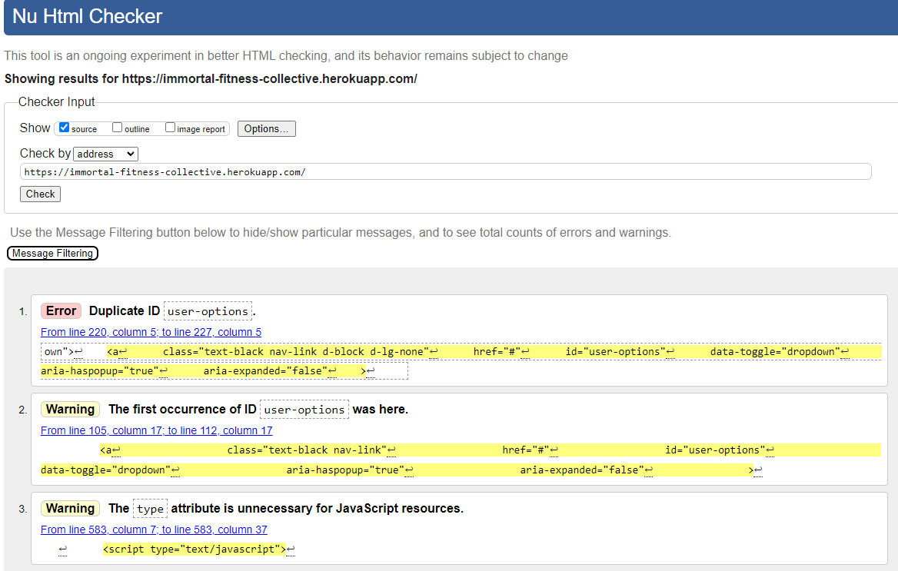

The validator shows an error for duplicate 'user-options' id, I've chosen to disregard this as one id is used on desktop, while the other is mobile. Both are required for bootstrap navigation dropdown to function properly.

The warning for 'type' javascript I have also chosen to disregard, as although unnecessary, it is useful for other developers to quickly see script code language.

I have filtered these errors and warnings for all other results.

</details>

<details>
<summary>about-us.html</summary>

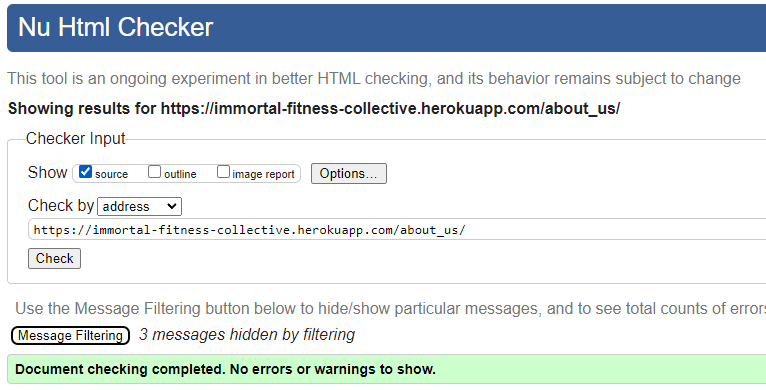

</details>

<details>
<summary>Programme.html</summary>

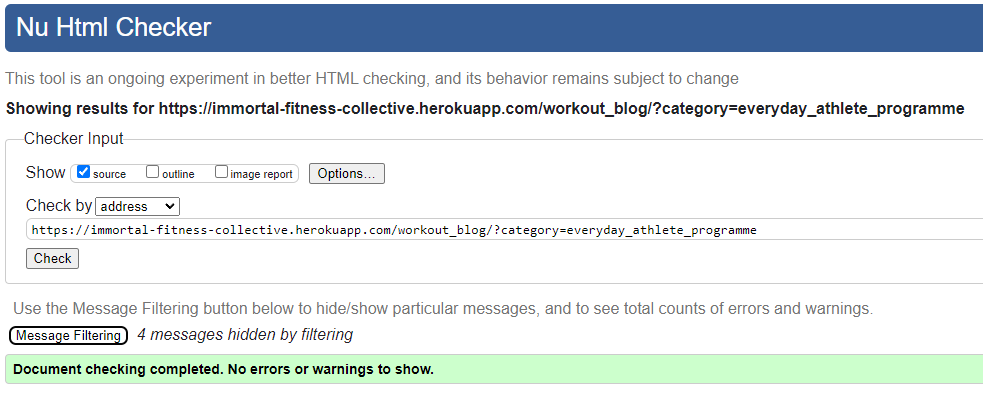

</details>

<details>
<summary>Products.html</summary>

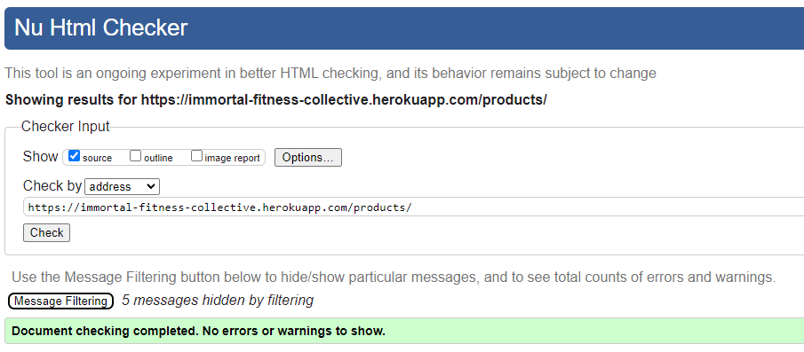

</details>

<details>
<summary>about-us.html</summary>

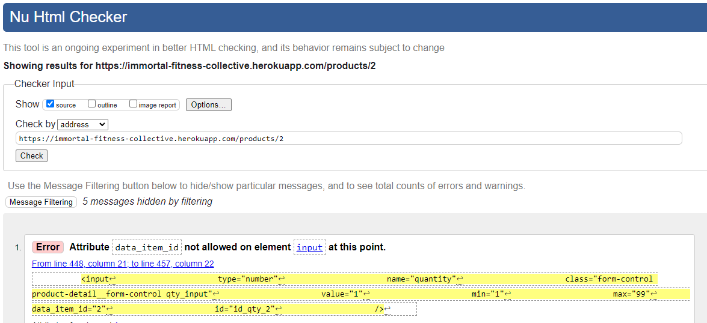

The validator shows an error for 'data_item_id' attribute not being allowed on form input, however I have disregarded this, as it's used for django to identify the product being adjusted in the bag.

</details>

### W3 CSS

I validated the CSS with the [W3 Validation Service](https://jigsaw.w3.org/css-validator/) and it found no errors.

<details>
<summary>Base</summary>

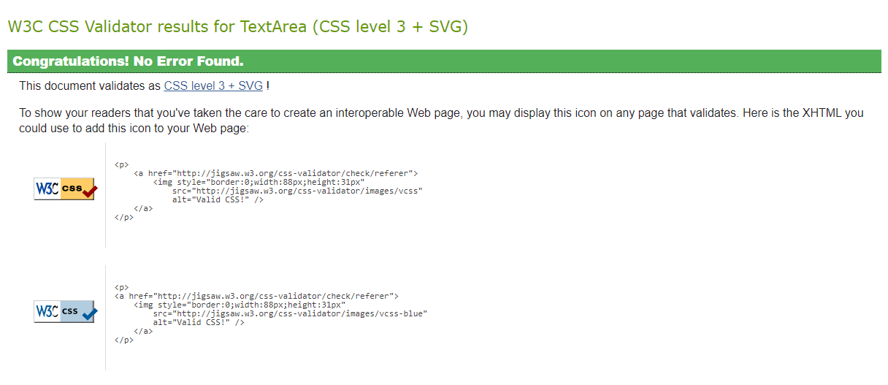

</details>

<details>
<summary>Profiles</summary>

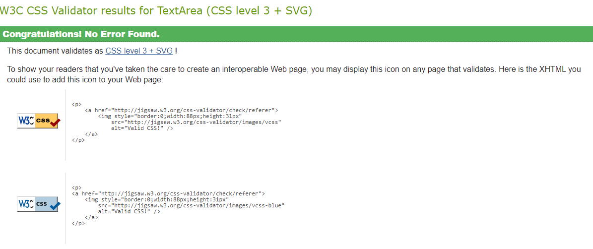

</details>
<details>
<summary>Checkout</summary>

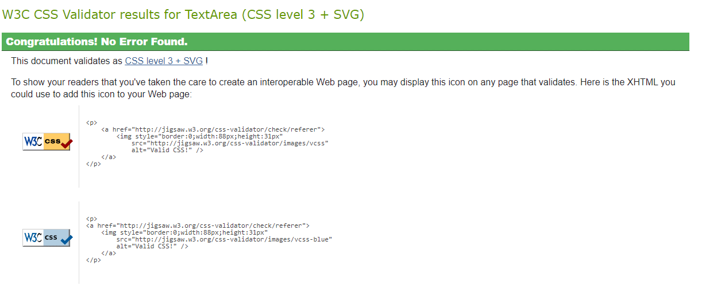

</details>

### JavaScript

I validated the JavaScript with [JSHint](https://jshint.com/).

<details>
<summary>countryfield.js</summary>

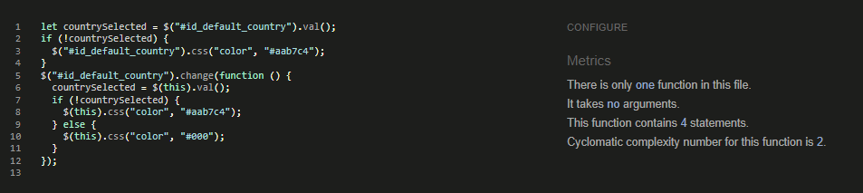
</details>

<details>
<summary>ratingstars.js</summary>

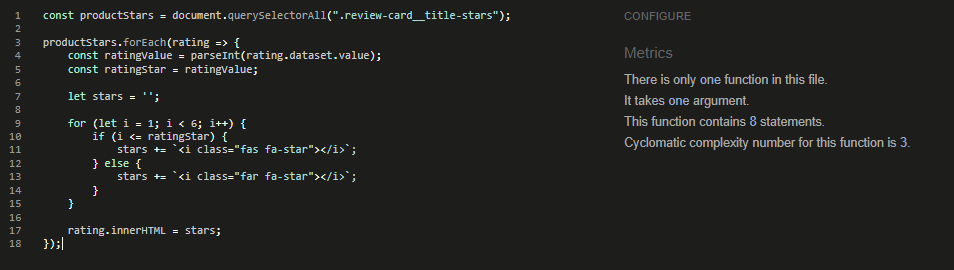
</details>

<details>
<summary>Stripe.js</summary>

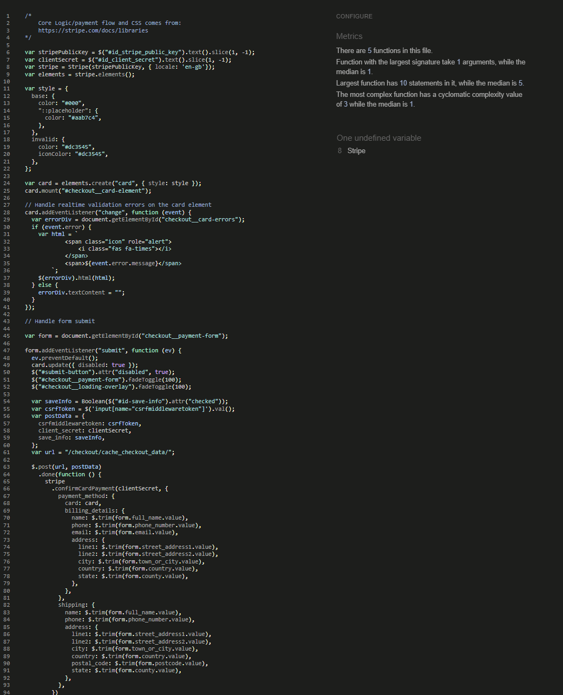

JSHint incorrectly identifies 'Stripe' as an undefined variable, however this is a variable used by Stripe and identified within their own scripts.
</details>

### Python

I validated the Python code was PEP 8 compliant via the [Pylint Validation Tool](https://www.pylint.org/) and [pycodestyle Validator](https://pypi.org/project/pycodestyle/), which found several simple errors I corrected.

All apps now received a score of over 9/10, any errors that do remain are either false-positives or superficial.

<details>
<summary>Home</summary>

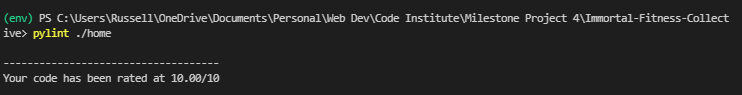
</details>

<details>
<summary>Immortal Fitness Collective</summary>


</details>

<details>
<summary>Bag</summary>

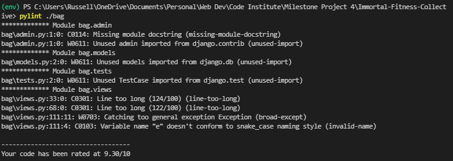
</details>

<details>
<summary>Checkout</summary>

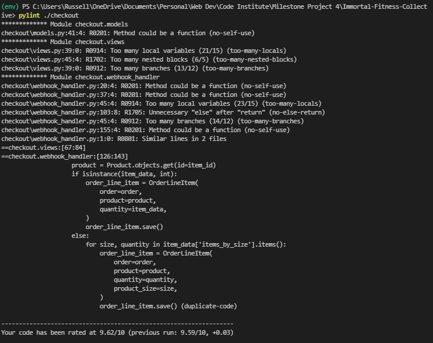
</details>

<details>
<summary>Products</summary>

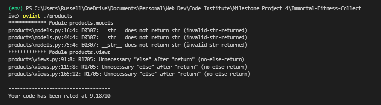
</details>

<details>
<summary>Profiles</summary>

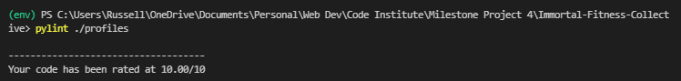
</details>

<details>
<summary>Workout Blog</summary>

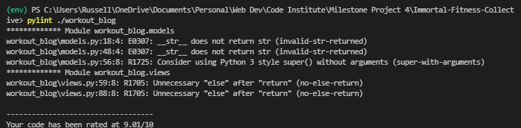
</details>

#### .pylintrc

After the above corrections, Pylint was still displaying a handful of warnings, however, these were false-positive results for the following reasons:

- import-outside-toplevel: This is flagging for the signal import in apps.py files, which is acceptable.
- unused-import, unused-argument and unused-variable: Flagging in various places, but all imports are required for method functionality.
- missing-module-docstring: Flagging on unused files automatically created by django, such as `__init__.py`.
- invalid-name & unused-argument: 'e' is an accepted variable, used to capture errors in error handling functionality.
- 'env' is the local file used to configure the development environment, as it is not pushed to live via .gitignore, pylint incorrectly believes the function is not used.

To clean up these false positives, I created a .pylintrc file and added the below rules to allow for these warning instances.

<details>
<summary>.pylintrc</summary>

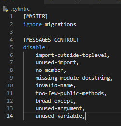
</details>

### Google Lighthouse Audit

I used Google's lighthouse audit to test the website conforms positively with Google's performance metrics, with the intent to achieve scores of 90% in all areas on desktop.

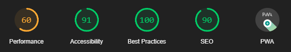

This shows 90%+ scores for all metrics except for performance. Upon checking the reasoning for the low performance score I decided to take no further action for the below reasons:

<details>
<Summary>Performance</Summary>

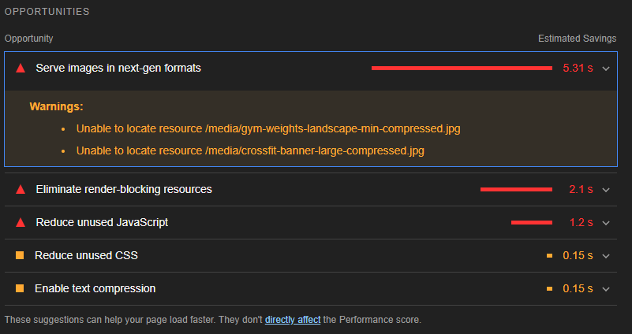

The driving factors to the low-performance score are, 'Serve images in next-gen formats' (such as WebP), 'Eliminate Render Blocking Resources' and 'Remove Unused JavaScript'. Due to Safari only recently adopting WebP compatibility, I chose to keep images as .jpg and .png. 

For 'Render Blocking'Resources' and 'Remove Unused JavaScript', the sources driving these are external resources, such as Boostrap and jQuery. Therefore as the underlying cause is due to third party scripts, no further on-site optimisation is suitable.

</details>

## Responsive Device & Browser Testing

To test the responsiveness of the site I used [Chrome DevTools](https://developers.google.com/web/tools/chrome-devtools), [Responsive Design Checker](https://www.responsivedesignchecker.com/) and [Lambdatest](https://www.lambdatest.com/).

### Responsiveness

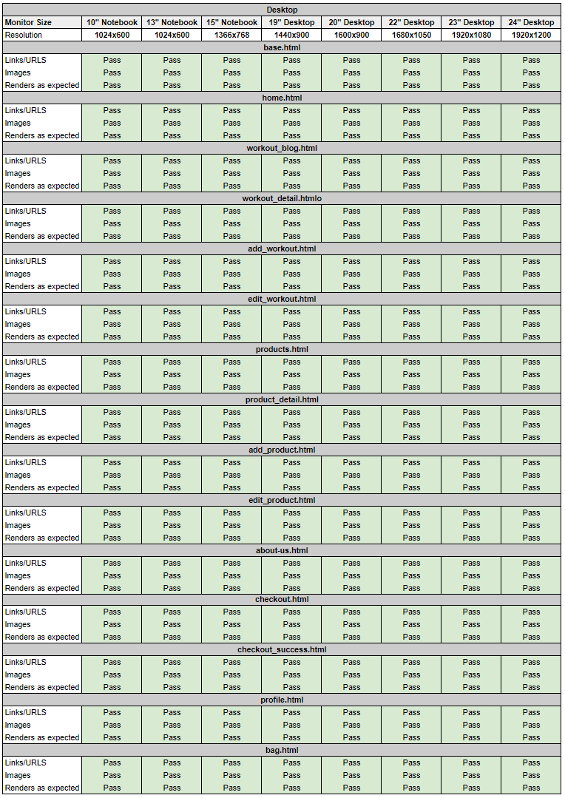

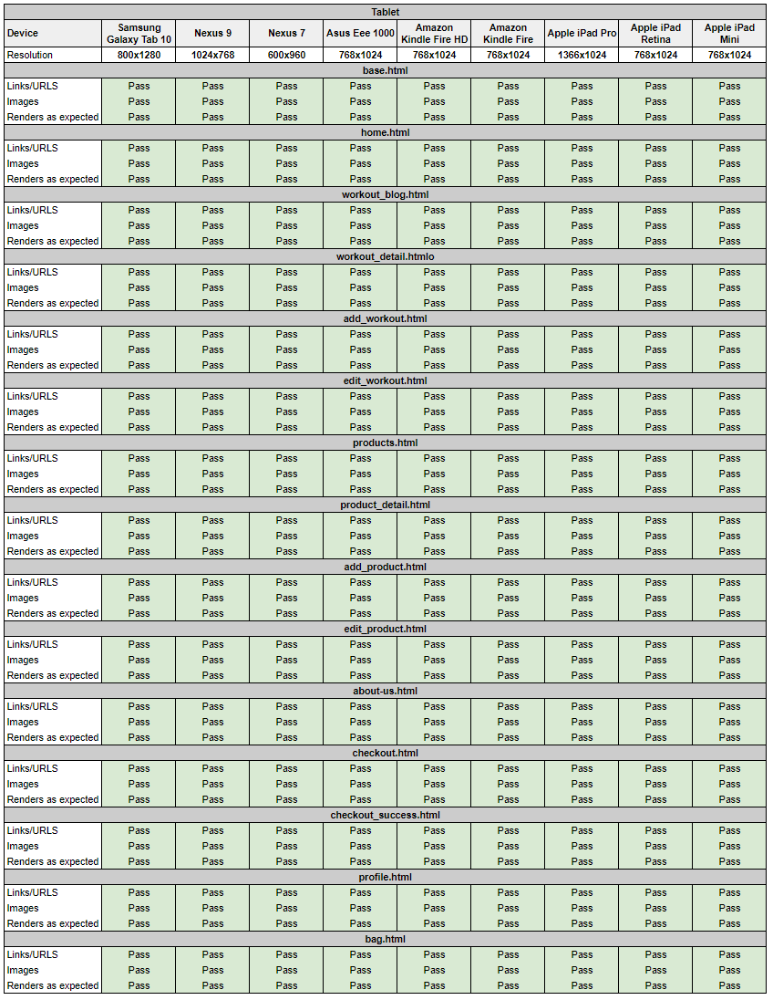

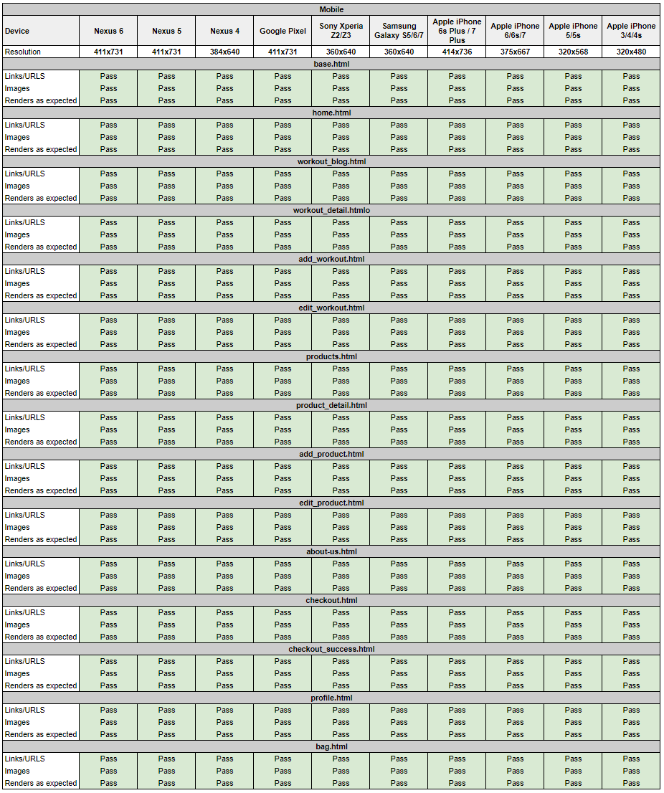

To ensure responsive design, I used bootstrap grid, flexbox, containers and custom media queries to ensure all site pages resized responsively for all mainstream device viewports.

### Browser Compatibility

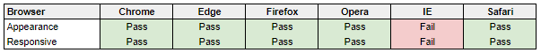

The site does not load properly while using Internet Explorer, due to modern CSS compatibility issues.

According to [caniuse](https://caniuse.com/usage-table) the current usage of Internet Explorer is 0.7% of total browser users, therefore I am comfortable not supporting IE in the site design.

Note: Microsoft released Internet Explorer in 1995 and ceased active development in 2015 when Microsoft Edge was released as the replacement, as evidenced by [this article](https://techcommunity.microsoft.com/t5/windows-it-pro-blog/the-perils-of-using-internet-explorer-as-your-default-browser/ba-p/331732) from Microsoft's design team. Since 2015 Microsoft has been actively encouraging users to adopt Edge over Explorer, with the only remaining updates for IE, being security patches and bug fixes.

## Testing User Stories

### Browsing

- US101: Home Page has clear CTA leading customers to online shop, alongside clear content promoting both fitness programmes and merchandise.
- US102: Site is responsive for all major device view ports, maintaining all key functionality, whilst displaying content clearly and legibly.
- US103: Navigation is clearly accessible at all times via the sticky-top navigation bar on all pages and view ports.
- US104: Purchase History is easily accessible via accessing 'My Account' in top navigation menu.

### Searching

- US201: Users can access product categories via links in top navigation menu.
- US202: User can access product details, via clicking on product card on catalogue page.
- US203: Users can search products by keyword, via use of 'Search' function in top navigation menu.
- US204: Users can sort products by rating via using the 'Sort By' function on product category page.
- US205: Users can sort products by price via using the 'Sort By' function on product category page.

### Users

- US301: Users can register accounts through the sites allauth integration.
  - The site restricts information shown to users based on whether they are unregistered, registered, staff or admin.
- US302: The site uses django and allauth to ensure secure logins and access restrictions.
  - The site enforces HTTPS to ensure user communications and data are transmitted securely.
  - Passwords are stored in hashed form for additional security.
  - User accounts store personal user info, such as basic personal details and checkout information.
- US303: Allauth allows users to request a password reset via 'Forgot Password?' option on login screen.
- US304: Registered users can leave ratings and reviews of products via form submission on product detail page.

### Administration

- US401: Admins are able to add, edit and delete workouts via the 'Workout Management' link in top navigation, 'Edit' and 'Delete' links on Workout Detail Pages.
- US402: Admins are able to add, edit and delete products via the 'Product Management' link in top navigation, 'Edit' and 'Delete' links on Product Detail Pages.
- US403: Admins can delete user reviews via 'delete' link on review posts.

### Purchasing and Checkout

- US501: Users can easily select products to add to basket via product catalogue page and adjust the amount via product detail page.
- US502: Users can review their basket contents via the 'bag' page, prior to checkout.
- US503: Users can adjust amount of a product in their basket, via the amount selection input in the 'bag' page.
- US504: Users can input their payment details via the stripe elements payment integrations on the checkout page.
- US505: Checkout is supported by secure stripes secure payment platform.
- US506: After checkout a success page is presented, giving the user details of their order and notification of e-mail confirmation.
- US507: After checkout an email is generated with the order information.

### General

- US601: To ensure users receive positive or negative feedback for their actions, confirmation pages and bootstrap toast messages are used extensively throughout the site.

&nbsp;

## Issues I had to overcome

### Recalculating Average Rating on New/Removed Customer Review

During the e-commerce learning project (Boutique Ado) I completed with Code Institute, product ratings were hard coded into the database. Therefore, I had to determine a way for products ratings to dynamically update with an average, when new reviews are added or existing reviews are deleted.

To do this, I chose to take a similar approach to how order totals are updated as items are added/removed from the basket - via using signals.

To implement this, I committed to the following steps;

<details>
<summary>1. Create a 'ProductReview' model:</summary>

Create a model to save customer review details. This included creating a `RATING_OPTIONS` array, to be used as `choices` in the `rating` field.

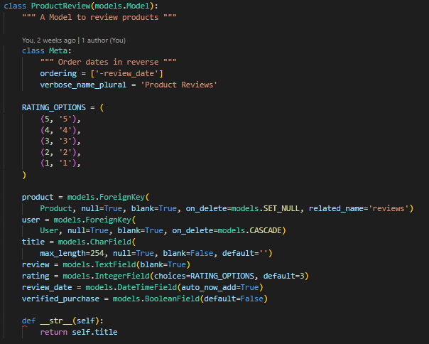

</details>

<details>
<summary>2. Update Product model with local formula: 'calculate_avg_rating':</summary>

Update the Product model with a new local formula, called 'calculate_avg_rating' which when called, will retrieve all reviews for the product and calculate the average rating score. To do this I leveraged pythons in-build `aggregate()` and django models in-build `AVG` functions.

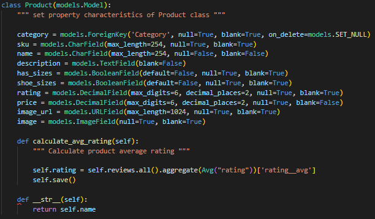

</details>

<details>
<summary>3. Create receiver signals, to call the 'calculate_avg_rating' formula on new and deleted reviews:</summary>

Create signals which call the 'calculate_avg_rating' function, when the ProductReview model is used in conjunction with the save() or delete() python functions. Using `instance.product` ensures that only the rating for the product the user is interacting with, is updated.

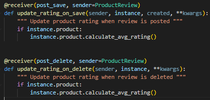

</details>

&nbsp;

### Pagination - Workout Programming

To ensure the future proofing of the site, it is important that the programming pages, showing daily workouts are paginated. Without pagination, these pages would quickly grow to be extremely long and have a negative effect on user experience.

To implement pagination, I chose to use django's inbuilt `Paginator` functionality, for which I followed the django documentation to implement;

[Django Paginator Documentation](https://docs.djangoproject.com/en/3.2/topics/pagination/#using-paginator-in-a-view-function)

I used Bootstrap's pagination styling to ensure a visually pleasing aesthetic, using [this article](https://ordinarycoders.com/blog/article/django-pagination) from ordinary coders for inspiration.

One small issue I encountered, was the pagination causing the programme category filter to break and all workouts to be displayed. To rectify this, I added the pagination code to the `if 'category'` request code in the view file, as seen below;

<details>
<summary>all_workouts - views.py</summary>

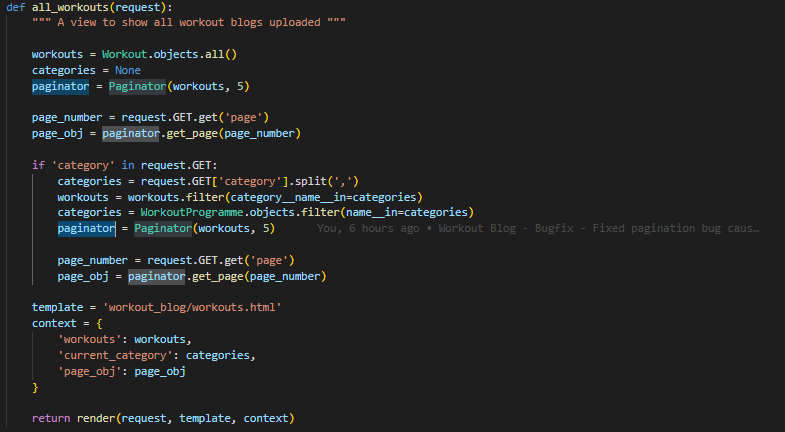

</details>

&nbsp;

#### Datepicker use for choosing programmed workout date

To ensure a positive user experience, I felt it was important to include a visual datepicker for date selection on the 'Workout Management' and 'Edit Workout' pages. Used a datepicker would also ensure the correct date format is input, avoiding unnecessary form validation errors.

To achieve this I again leveraged Bootstrap and decided to use the [Bootstrap Datepicker](https://bootstrap-datepicker.readthedocs.io/en/latest/) widget.

Following the documentation, I had to complete  the following steps for implementation:

<details>
<summary>1. Install bootstrap_datepicker_plus and add to WorkoutForm in forms.py:</summary>

In my IDE command line I installed the package via the following command, then adding to the requirements.txt;

```console
python install bootstrap_datepicker_plus
python freeze > requirements.txt
```

I then added this to the WorkoutForm class in forms.py, adding the widget and updating settings to `format='%d/%m/%Y'` to align to django's `DateField` field types required format under the 'Workout' model.

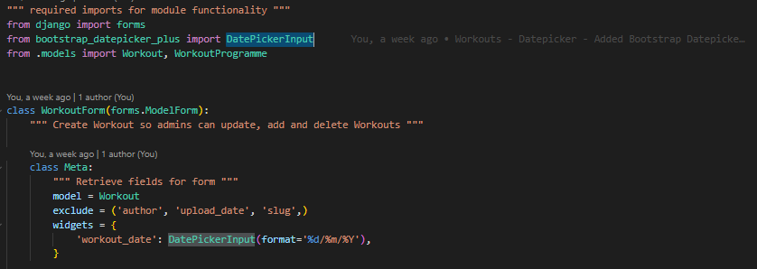

</details>

<details>
<summary>2. Update form creation in html template:</summary>

In order for the form to render with the added widget, the jinja formatting for form creation must be updated to include {{ form.media }}.


</details>

&nbsp;

### Deployed site returning 500 error when new models added

After I'd deployed the site to Heroku, I added some additional functionality, which required new models and new migrations (e.g. ProductReview). Due to the new migrations required, Heroku would fail the site build process and the deployed site would return 500 errors for a number of pages.

After researching the issue, I found [this](https://help.heroku.com/GDQ74SU2/django-migrations) Heroku help article, detailing the need to add the following migrate command to the Procfile - which will force migrations to be made during Heroku's automatic site build and deployment process.

```python
release: python manage.py migrate
```

Upon implementing this, the site build completed and site functionality returned to normal.

&nbsp;

### Add confirmation modal for deleting products/reviews from list view

To ensure items are not deleted by accident, it is important to add a confirmation modal to item deletions. For pages where only a single database item is present (product_details, workout_details) this is simple, however for pages where multiple items are displayed in list format, this is more complicated.

After researching how to implement this correctly, I found the following article by [Elise Lennion](https://elennion.wordpress.com/2018/10/08/bootstrap-4-delete-confirmation-modal-for-list-of-items/).

The solution is to use javascript (jQuery) to pass the modal the unique id of the element which last triggered the modal, to ensure deletion of the correct one.

To accomplish this I carried out the following steps;

Below uses product reviews as an example, but confirmation modals also added to product and workout deletion.

<details>
<summary>1. Create Bootstrap Modal and insert to HTML using template:</summary>

Create modal template in new file `templates/products/delete_review_modal.html`:

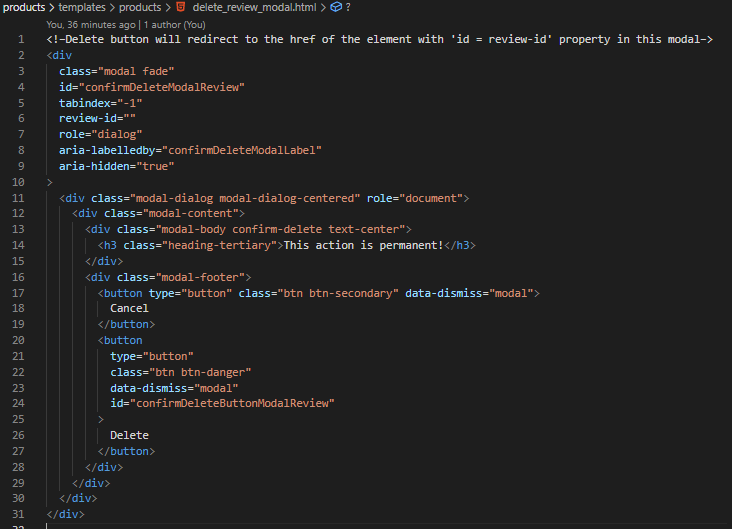

Insert html to product_detail page;

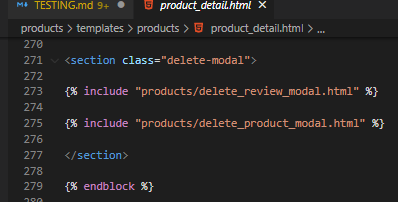

</details>

<details>
<summary>2. Update Delete links to call modal:</summary>

Update 'Delete' a-link to open Bootstap modal via `data-toggle`:


Update `data-target` to target modal id. Also include `confirm-delete` in class,`{{review.id}}` in button id and href uses django routing to point to `delete_review` url with correct review id as usual, these are all used in our next step for jQuery targeting.

</details>

<details>
<summary>3. Pass review ID to modal using jQuery and using this to create redirect link to delete_review url:</summary>

Create a new static javaScript file in `static/products/js/delete_review.js`:

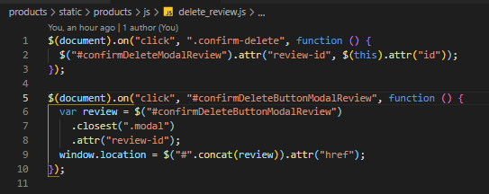

The first block adds an event handler for the click event in elements of the class `confirm-delete`. When the click happens, it writes the id of the element in the `review-id` of the modal.

The second block adds a handler for the click event of the confirmation button inside the modal. It finds the element which toggled the modal, by the `review-id`, and redirect the page to its href, the delete URL in this case.

</details>

&nbsp;

## Issues still to overcome

### Improved slug generation for workout posts

Currently the url-slug generated when workouts are posted is a combination of the category friendly name and the title.

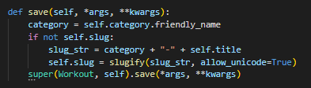

Site admins only plan to post one workout per day, so this is currently not an issue. However, there is still danger of human error causing a non-unique slug error. Adding a randomly generated ID to the slug would reduce this risk and be an improvement in future.

### Restrict reviews to verified purchasers

Currently anyone with a registered profile can leave a review for a product, even if they have not purchased it yet - however, customers who have purchased the product are marked as 'verified purchaser' when leaving a review. An improvement would be to restrict users to only be able to leave a review after they have purchased the product.

This could be managed via implementing signals to mark a user as a verified purchaser of a product on successful purchase completion.
